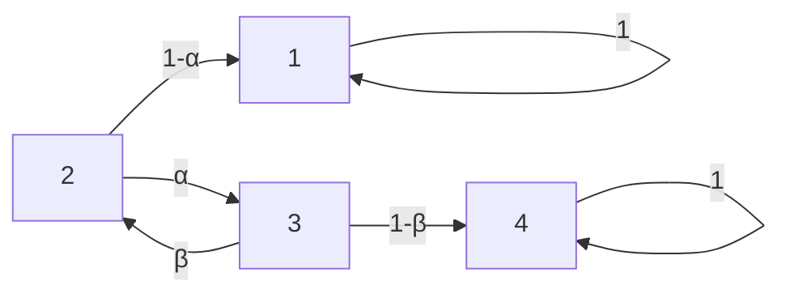

# Problem Sheet 4 - 详细解答 / Detailed Solutions

> MATH2702 Stochastic Processes
> 生成时间 / Generated: 2026-07-20 16:03
> 来源页 / Source Pages: 49-50

---

好的，作为您的大学数学导师，我将为您提供MATH2702：随机过程习题课4的完整、详细的双语解答。

---

### Question 1 / 第1题

**Problem / 题目原文:**
Consider the Markov chain with state space 𝑆= {1, 2, 3, 4} and transition matrix
P =
$$
\begin{pmatrix}
1 & 0 & 0 & 0 \\
1 −𝛼 & 0 & 𝛼 & 0 \\
0 & 𝛽 & 0 & 1 −𝛽 \\
0 & 0 & 0 & 1
\end{pmatrix}
$$
where 0 < 𝛼, 𝛽< 1.
(a) Draw a transition diagram for this Markov chain.
(b) What are the communicating classes for this Markov chain?
Are they positive recurrent, null
recurrent, or transient? Is the chain irreducible? Which classes are closed? Which states are absorbing?
(c) Find the hitting probability ℎ21 that, starting from state 2, the chain hits state 1.
(d) What is the expected time, starting from state 2, to reach an absorbing state?

**中文翻译 / Chinese Translation:**
考虑一个状态空间为 𝑆= {1, 2, 3, 4} 的马尔可夫链，其转移矩阵为
P =
$$
\begin{pmatrix}
1 & 0 & 0 & 0 \\
1 −𝛼 & 0 & 𝛼 & 0 \\
0 & 𝛽 & 0 & 1 −𝛽 \\
0 & 0 & 0 & 1
\end{pmatrix}
$$
其中 0 < 𝛼, 𝛽< 1。
(a) 画出这个马尔可夫链的转移图。
(b) 这个马尔可夫链的通信类是什么？它们是正常返、零常返还是瞬过的？这个链是不可约的吗？哪些类是封闭的？哪些状态是吸收态？
(c) 求从状态2出发，链击中状态1的击中概率 ℎ21。
(d) 从状态2出发，到达一个吸收态的期望时间是多少？

**Knowledge Points / 考查知识点:**
- 马尔可夫链的转移图、通信类、不可约性、常返性与瞬过性、封闭类、吸收态、击中概率、期望吸收时间。
- Transition diagram, communicating classes, irreducibility, recurrence/transience, closed classes, absorbing states, hitting probabilities, expected absorption time.

**Step-by-Step Solution / 逐步解答:**

**(a) Transition Diagram / 转移图**

**中文思路 / Chinese reasoning:**
首先，我们需要根据转移矩阵 P 画出转移图。矩阵的每个元素 P(i, j) 表示从状态 i 转移到状态 j 的概率。我们逐行分析：
- 第1行: P(1,1)=1。这意味着从状态1出发，以概率1停留在状态1。所以状态1有一个指向自身的环。
- 第2行: P(2,1)=1-α, P(2,3)=α。从状态2出发，以概率1-α去状态1，以概率α去状态3。
- 第3行: P(3,2)=β, P(3,4)=1-β。从状态3出发，以概率β去状态2，以概率1-β去状态4。
- 第4行: P(4,4)=1。从状态4出发，以概率1停留在状态4。所以状态4有一个指向自身的环。

**English reasoning:**
First, we need to draw the transition diagram based on the transition matrix P. Each element P(i, j) represents the probability of moving from state i to state j. We analyze row by row:
- Row 1: P(1,1)=1. This means from state 1, we stay in state 1 with probability 1. So state 1 has a self-loop.
- Row 2: P(2,1)=1-α, P(2,3)=α. From state 2, we go to state 1 with probability 1-α and to state 3 with probability α.
- Row 3: P(3,2)=β, P(3,4)=1-β. From state 3, we go to state 2 with probability β and to state 4 with probability 1-β.
- Row 4: P(4,4)=1. From state 4, we stay in state 4 with probability 1. So state 4 has a self-loop.

**计算过程 / Working:**
The transition diagram is drawn as follows:

**Explanation of working / 过程解释:**
图中有四个节点，分别代表状态1、2、3、4。箭头表示可能的转移，箭头上的数字表示转移概率。状态1和4的箭头指向自己，表示它们是吸收态。状态2可以转移到1或3，状态3可以转移到2或4。

The diagram has four nodes representing states 1, 2, 3, and 4. Arrows indicate possible transitions, and the numbers on the arrows are the transition probabilities. States 1 and 4 have arrows pointing to themselves, indicating they are absorbing states. State 2 can transition to 1 or 3, and state 3 can transition to 2 or 4.

**(b) Communicating Classes, Recurrence, Transience, Irreducibility, Closed Classes, Absorbing States / 通信类、常返性、瞬过性、不可约性、封闭类、吸收态**

**中文思路 / Chinese reasoning:**
1.  **通信类**: 我们需要找出所有相互可达的状态集合。
    - 状态1: 从1只能到1，不能到其他任何状态。所以{1}是一个通信类。
    - 状态4: 从4只能到4，不能到其他任何状态。所以{4}是一个通信类。
    - 状态2和3: 从2可以到3，从3可以到2。所以2和3是相互可达的。它们能到达1和4，但不能从1或4回来。所以{2, 3}是一个通信类。
2.  **常返/瞬过**: 对于有限状态空间的马尔可夫链，一个状态是常返的当且仅当它属于一个封闭类。否则是瞬过的。
    - 类{1}是封闭的（因为从1不能出去），所以状态1是常返的。由于状态空间有限，它一定是正常返的。
    - 类{4}是封闭的，所以状态4是正常返的。
    - 类{2, 3}不是封闭的（因为可以从2或3离开到1或4），所以状态2和3是瞬过的。
3.  **不可约性**: 如果整个状态空间只有一个通信类，则链是不可约的。这里我们有三个通信类，所以链是可约的。
4.  **封闭类**: 一个类如果从类内任何状态出发都不能到达类外的状态，则它是封闭的。{1}和{4}是封闭的。{2, 3}不是封闭的。
5.  **吸收态**: 如果一个状态一旦进入就永远无法离开，则它是吸收态。这意味着 P(i,i)=1。状态1和4满足这个条件，所以它们是吸收态。

**English reasoning:**
1.  **Communicating Classes**: We need to find all sets of states that are mutually accessible.
    - State 1: From 1, we can only go to 1, and cannot reach any other state. So {1} is a communicating class.
    - State 4: From 4, we can only go to 4, and cannot reach any other state. So {4} is a communicating class.
    - States 2 and 3: From 2 we can go to 3, and from 3 we can go to 2. So 2 and 3 are mutually accessible. They can reach 1 and 4, but cannot return from 1 or 4. So {2, 3} is a communicating class.
2.  **Recurrence/Transience**: For a Markov chain on a finite state space, a state is recurrent if and only if it belongs to a closed class. Otherwise, it is transient.
    - Class {1} is closed (since you cannot leave 1), so state 1 is recurrent. Since the state space is finite, it must be positive recurrent.
    - Class {4} is closed, so state 4 is positive recurrent.
    - Class {2, 3} is not closed (since you can leave 2 or 3 to go to 1 or 4), so states 2 and 3 are transient.
3.  **Irreducibility**: A chain is irreducible if the entire state space is a single communicating class. Here we have three communicating classes, so the chain is reducible.
4.  **Closed Classes**: A class is closed if no state inside the class can reach a state outside the class. {1} and {4} are closed. {2, 3} is not closed.
5.  **Absorbing States**: A state is absorbing if once entered, it can never be left. This means P(i,i)=1. States 1 and 4 satisfy this, so they are absorbing states.

**计算过程 / Working:**
- Communicating classes: {1}, {2, 3}, {4}
- Recurrence/Transience: States 1 and 4 are positive recurrent. States 2 and 3 are transient.
- Irreducibility: The chain is reducible.
- Closed classes: {1} and {4} are closed.
- Absorbing states: States 1 and 4 are absorbing.

**Explanation of working / 过程解释:**
我们通过分析状态之间的可达性来划分通信类。一个类如果无法离开，就是封闭的。在有限状态空间中，封闭类中的状态是正常返的，非封闭类中的状态是瞬过的。吸收态是特殊的封闭类，只包含一个状态。

We partition the state space into communicating classes by analyzing accessibility between states. A class is closed if it is impossible to leave. In a finite state space, states in a closed class are positive recurrent, and states in a non-closed class are transient. An absorbing state is a special closed class containing only one state.

**(c) Hitting Probability ℎ₂₁ / 击中概率 ℎ₂₁**

**中文思路 / Chinese reasoning:**
我们需要求从状态2出发，最终到达状态1的概率。设 ℎᵢ 为从状态 i 出发，最终击中状态1的概率。我们要求 ℎ₂。
根据一步分析法（First Step Analysis），我们可以写出方程：
- 对于状态1（目标状态）：ℎ₁ = 1
- 对于状态4（吸收态，但不是目标）：ℎ₄ = 0
- 对于状态2：ℎ₂ = P(2,1) * ℎ₁ + P(2,2) * ℎ₂ + P(2,3) * ℎ₃ + P(2,4) * ℎ₄
- 对于状态3：ℎ₃ = P(3,1) * ℎ₁ + P(3,2) * ℎ₂ + P(3,3) * ℎ₃ + P(3,4) * ℎ₄

代入转移概率，我们得到关于 ℎ₂ 和 ℎ₃ 的方程组，然后求解。

**English reasoning:**
We need to find the probability of eventually hitting state 1, starting from state 2. Let ℎᵢ be the probability of eventually hitting state 1, starting from state i. We want ℎ₂.
Using First Step Analysis, we can write the equations:
- For state 1 (target state): ℎ₁ = 1
- For state 4 (absorbing state, but not the target): ℎ₄ = 0
- For state 2: ℎ₂ = P(2,1) * ℎ₁ + P(2,2) * ℎ₂ + P(2,3) * ℎ₃ + P(2,4) * ℎ₄
- For state 3: ℎ₃ = P(3,1) * ℎ₁ + P(3,2) * ℎ₂ + P(3,3) * ℎ₃ + P(3,4) * ℎ₄

Substituting the transition probabilities, we get a system of equations for ℎ₂ and ℎ₃, which we then solve.

**计算过程 / Working:**
The equations are:
1. ℎ₁ = 1
2. ℎ₄ = 0
3. ℎ₂ = (1-α) * ℎ₁ + 0 * ℎ₂ + α * ℎ₃ + 0 * ℎ₄ = (1-α) * 1 + α * ℎ₃
4. ℎ₃ = 0 * ℎ₁ + β * ℎ₂ + 0 * ℎ₃ + (1-β) * ℎ₄ = β * ℎ₂ + (1-β) * 0

So we have:
ℎ₂ = 1 - α + α ℎ₃  ...(1)
ℎ₃ = β ℎ₂          ...(2)

Substitute (2) into (1):
ℎ₂ = 1 - α + α (β ℎ₂)
ℎ₂ = 1 - α + αβ ℎ₂
ℎ₂ - αβ ℎ₂ = 1 - α
ℎ₂ (1 - αβ) = 1 - α
ℎ₂ = (1 - α) / (1 - αβ)

**Explanation of working / 过程解释:**
我们使用了一步分析法。对于非目标吸收态（状态4），击中概率为0。对于目标状态（状态1），击中概率为1。对于其他状态，击中概率等于从该状态出发，经过一步转移后，从新状态出发的击中概率的加权平均，权重为转移概率。然后我们解这个线性方程组。

We used the First Step Analysis. For a non-target absorbing state (state 4), the hitting probability is 0. For the target state (state 1), the hitting probability is 1. For other states, the hitting probability is the weighted average of the hitting probabilities from the next states, weighted by the transition probabilities. We then solved this system of linear equations.

**(d) Expected Time to Absorption from State 2 / 从状态2出发的期望吸收时间**

**中文思路 / Chinese reasoning:**
我们需要求从状态2出发，到达任何一个吸收态（状态1或状态4）的期望步数。设 μᵢ 为从状态 i 出发的期望吸收时间。对于吸收态，μ₁ = 0, μ₄ = 0。对于瞬态2和3，我们再次使用一步分析法。
从状态2出发，经过一步后：
- 以概率 1-α 到达吸收态1，剩余期望时间为0。
- 以概率 α 到达状态3，剩余期望时间为 μ₃。
所以 μ₂ = 1 + (1-α) * 0 + α * μ₃ = 1 + α μ₃。
从状态3出发，经过一步后：
- 以概率 β 到达状态2，剩余期望时间为 μ₂。
- 以概率 1-β 到达吸收态4，剩余期望时间为0。
所以 μ₃ = 1 + β * μ₂ + (1-β) * 0 = 1 + β μ₂。
然后我们解这个关于 μ₂ 和 μ₃ 的方程组。

**English reasoning:**
We need to find the expected number of steps to reach any absorbing state (state 1 or state 4), starting from state 2. Let μᵢ be the expected absorption time starting from state i. For absorbing states, μ₁ = 0, μ₄ = 0. For transient states 2 and 3, we again use First Step Analysis.
Starting from state 2, after one step:
- With probability 1-α, we reach absorbing state 1, with 0 remaining expected time.
- With probability α, we reach state 3, with remaining expected time μ₃.
So μ₂ = 1 + (1-α) * 0 + α * μ₃ = 1 + α μ₃.
Starting from state 3, after one step:
- With probability β, we reach state 2, with remaining expected time μ₂.
- With probability 1-β, we reach absorbing state 4, with 0 remaining expected time.
So μ₃ = 1 + β * μ₂ + (1-β) * 0 = 1 + β μ₂.
We then solve this system of equations for μ₂ and μ₃.

**计算过程 / Working:**
The equations are:
μ₂ = 1 + α μ₃  ...(1)
μ₃ = 1 + β μ₂  ...(2)

Substitute (2) into (1):
μ₂ = 1 + α (1 + β μ₂)
μ₂ = 1 + α + αβ μ₂
μ₂ - αβ μ₂ = 1 + α
μ₂ (1 - αβ) = 1 + α
μ₂ = (1 + α) / (1 - αβ)

**Explanation of working / 过程解释:**
期望吸收时间的一步分析法与击中概率类似，但我们需要加上“1”来表示已经走了一步。对于瞬态，期望时间等于1（当前步）加上从下一步状态出发的期望时间的加权平均。然后我们解这个线性方程组。

The First Step Analysis for expected absorption time is similar to that for hitting probabilities, but we add "1" to account for the step just taken. For transient states, the expected time is 1 (for the current step) plus the weighted average of the expected times from the next states. We then solve this system of linear equations.

**Final Answer / 最终答案:**
(a) Transition diagram is shown above.
(b) Communicating classes: {1}, {2, 3}, {4}. States 1 and 4 are positive recurrent. States 2 and 3 are transient. The chain is reducible. Closed classes: {1}, {4}. Absorbing states: 1, 4.
(c) ℎ₂₁ = (1 - α) / (1 - αβ)
(d) Expected time from state 2 to absorption = (1 + α) / (1 - αβ)

(a) 转移图如上所示。
(b) 通信类：{1}, {2, 3}, {4}。状态1和4是正常返的。状态2和3是瞬过的。链是可约的。封闭类：{1}, {4}。吸收态：1, 4。
(c) ℎ₂₁ = (1 - α) / (1 - αβ)
(d) 从状态2到吸收的期望时间 = (1 + α) / (1 - αβ)

**Key Insight / 解题要点:**
- 对于有吸收态的马尔可夫链，击中概率和期望吸收时间可以通过解一个线性方程组来求得，这个方程组来源于一步分析法。
- For Markov chains with absorbing states, hitting probabilities and expected absorption times can be found by solving a system of linear equations derived from the First Step Analysis.

---

### Question 2 / 第2题

**Problem / 题目原文:**
Prove the backwards Markov property. For (𝑋𝑛)𝑛∈ℕa Markov chain on state space 𝑆and 𝑁> 0
fixed show that for any feasible sequence 𝑥₀, 𝑥₁, … , 𝑥ₖ₊₁ ∈𝑆, 𝑘+ 1 ≤𝑁, we have
ℙ(𝑋_{𝑁-𝑘-1} = 𝑥_{𝑘+1} ∣𝑋_{𝑁-𝑘}= 𝑥_𝑘, ⋯, 𝑋_{𝑁-1} = 𝑥_1, 𝑋_𝑁= 𝑥_0) = ℙ(𝑋_{𝑁-𝑘-1} = 𝑥_{𝑘+1} ∣𝑋_{𝑁-𝑘}= 𝑥_𝑘).
Hint: This is an exercise in conditional probability! Use the definition of conditional probability on the
left side and now find convenient things to condition the top and bottom of your expression on.

**中文翻译 / Chinese Translation:**
证明逆向马尔可夫性质。对于 (𝑋ₙ)ₙ∈ℕ 是状态空间 S 上的一个马尔可夫链，且 N > 0 固定，证明对于任意可行序列 𝑥₀, 𝑥₁, … , 𝑥ₖ₊₁ ∈𝑆, 𝑘+ 1 ≤𝑁，我们有
ℙ(𝑋_{𝑁-𝑘-1} = 𝑥_{𝑘+1} ∣𝑋_{𝑁-𝑘}= 𝑥_𝑘, ⋯, 𝑋_{𝑁-1} = 𝑥_1, 𝑋_𝑁= 𝑥_0) = ℙ(𝑋_{𝑁-𝑘-1} = 𝑥_{𝑘+1} ∣𝑋_{𝑁-𝑘}= 𝑥_𝑘).
提示：这是一个条件概率的练习！在左侧使用条件概率的定义，然后找到方便的条件来对表达式的分子和分母进行条件处理。

**Knowledge Points / 考查知识点:**
- 马尔可夫性质、条件概率、逆向马尔可夫性质。
- Markov property, conditional probability, backwards Markov property.

**Step-by-Step Solution / 逐步解答:**

**中文思路 / Chinese reasoning:**
我们需要证明逆向马尔可夫性质：给定未来的状态，过去的状态与更远的过去条件独立。换句话说，给定 X_{N-k}，X_{N-k-1} 与 X_{N-k+1}, ..., X_N 条件独立。
证明的关键是利用原始马尔可夫性质（正向）和条件概率的定义。提示建议我们使用条件概率的定义来展开左边，然后对分子和分母进行条件处理，以便应用正向马尔可夫性质。

**English reasoning:**
We need to prove the backwards Markov property: given future states, the past state is conditionally independent of the more distant past. In other words, given X_{N-k}, X_{N-k-1} is conditionally independent of X_{N-k+1}, ..., X_N.
The key to the proof is to use the original (forward) Markov property and the definition of conditional probability. The hint suggests we expand the left-hand side using the definition of conditional probability, and then condition the numerator and denominator in a convenient way to apply the forward Markov property.

**计算过程 / Working:**
Let's denote the left-hand side as LHS. We want to show:
LHS = ℙ(𝑋_{𝑁-𝑘-1} = 𝑥_{𝑘+1} ∣ 𝑋_{𝑁-𝑘} = 𝑥_𝑘)

We start with the definition of conditional probability:
LHS = ℙ(𝑋_{𝑁-𝑘-1} = 𝑥_{𝑘+1} ∣ 𝑋_{𝑁-𝑘}= 𝑥_𝑘, 𝑋_{𝑁-𝑘+1}= 𝑥_{𝑘-1}, ..., 𝑋_{𝑁-1}= 𝑥_1, 𝑋_𝑁= 𝑥_0)

By definition:
LHS = ℙ(𝑋_{𝑁-𝑘-1} = 𝑥_{𝑘+1}, 𝑋_{𝑁-𝑘}= 𝑥_𝑘, 𝑋_{𝑁-𝑘+1}= 𝑥_{𝑘-1}, ..., 𝑋_𝑁= 𝑥_0) / ℙ(𝑋_{𝑁-𝑘}= 𝑥_𝑘, 𝑋_{𝑁-𝑘+1}= 𝑥_{𝑘-1}, ..., 𝑋_𝑁= 𝑥_0)

Now, we can rewrite the numerator and denominator using the chain rule of probability, conditioning on the "future" states. Let's define the event A = {𝑋_{𝑁-𝑘-1} = 𝑥_{𝑘+1}} and the event B = {𝑋_{𝑁-𝑘}= 𝑥_𝑘, 𝑋_{𝑁-𝑘+1}= 𝑥_{𝑘-1}, ..., 𝑋_𝑁= 𝑥_0}. We can think of the sequence in reverse order: X_N, X_{N-1}, ..., X_{N-k-1}.

Consider the joint probability in the numerator:
ℙ(𝑋_{𝑁-𝑘-1} = 𝑥_{𝑘+1}, 𝑋_{𝑁-𝑘}= 𝑥_𝑘, ..., 𝑋_𝑁= 𝑥_0)
= ℙ(𝑋_𝑁= 𝑥_0, 𝑋_{𝑁-1}= 𝑥_1, ..., 𝑋_{𝑁-𝑘}= 𝑥_𝑘, 𝑋_{𝑁-𝑘-1}= 𝑥_{𝑘+1})

We can factor this using the Markov property in the forward direction. The forward Markov property says that the future depends on the past only through the present. Here, if we consider the sequence in the original order (increasing index), we have:
ℙ(𝑋_0, 𝑋_1, ..., 𝑋_n) = ℙ(𝑋_0) * ℙ(𝑋_1|𝑋_0) * ℙ(𝑋_2|𝑋_1) * ... * ℙ(𝑋_n|𝑋_{n-1})

However, our indices are decreasing. Let's define a new index m = N - k - 1. Then the sequence in the numerator is X_m, X_{m+1}, ..., X_N. The joint probability of this sequence is:
ℙ(𝑋_m = 𝑥_{𝑘+1}, 𝑋_{m+1} = 𝑥_𝑘, ..., 𝑋_N = 𝑥_0)

Using the forward Markov property, we can write this as:
ℙ(𝑋_m = 𝑥_{𝑘+1}) * ℙ(𝑋_{m+1} = 𝑥_𝑘 | 𝑋_m = 𝑥_{𝑘+1}) * ℙ(𝑋_{m+2} = 𝑥_{𝑘-1} | 𝑋_{m+1} = 𝑥_𝑘) * ... * ℙ(𝑋_N = 𝑥_0 | 𝑋_{N-1} = 𝑥_1)

Similarly, the denominator is:
ℙ(𝑋_{N-k}= 𝑥_𝑘, ..., 𝑋_N= 𝑥_0) = ℙ(𝑋_{m+1}= 𝑥_𝑘, ..., 𝑋_N= 𝑥_0)
= ℙ(𝑋_{m+1} = 𝑥_𝑘) * ℙ(𝑋_{m+2} = 𝑥_{k-1} | 𝑋_{m+1} = 𝑥_𝑘) * ... * ℙ(𝑋_N = 𝑥_0 | 𝑋_{N-1} = 𝑥_1)

Now, let's compute the ratio LHS = Numerator / Denominator:
LHS = [ℙ(𝑋_m = 𝑥_{𝑘+1}) * ℙ(𝑋_{m+1} = 𝑥_𝑘 | 𝑋_m = 𝑥_{𝑘+1}) * ℙ(𝑋_{m+2} = 𝑥_{𝑘-1} | 𝑋_{m+1} = 𝑥_𝑘) * ... * ℙ(𝑋_N = 𝑥_0 | 𝑋_{N-1} = 𝑥_1)] / [ℙ(𝑋_{m+1} = 𝑥_𝑘) * ℙ(𝑋_{m+2} = 𝑥_{k-1} | 𝑋_{m+1} = 𝑥_𝑘) * ... * ℙ(𝑋_N = 𝑥_0 | 𝑋_{N-1} = 𝑥_1)]

