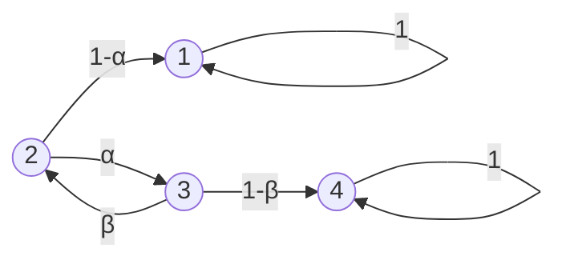

# Problem Sheet 4 - 详细解答 / Detailed Solutions

> MATH2702 Stochastic Processes
> 生成时间 / Generated: 2026-07-17 15:12
> 来源页 / Source Pages: 49-50

---

好的，作为大学数学导师，我将为MATH2702: 随机过程 的问题单4提供详细的逐步解答。

---

### Question 1 / 第1题

**Problem / 题目原文:**
Consider the Markov chain with state space 𝑆 = {1,2,3,4} and transition matrix
P=⎛⎜⎜⎜
⎝1 0 0 0
1−𝛼 0 𝛼 0
0 𝛽 0 1−𝛽
0 0 0 1⎞⎟⎟⎟
⎠
where0 < 𝛼,𝛽 < 1 .
(a) Draw a transition diagram for this Markov chain.
(b) What are the communicating classes for this Markov chain? Are they positive recurrent, null
recurrent, or transient? Is the chain irreducible? Which classes are closed? Which states are absorbing?
(c) Find the hitting probability ℎ21 that, starting from state 2, the chain hits state 1.
(d) What is the expected time, starting from state 2, to reach an absorbing state?

**中文翻译:**
考虑一个状态空间为 𝑆 = {1,2,3,4} 的马尔可夫链，其转移矩阵为
P=⎛⎜⎜⎜
⎝1 0 0 0
1−𝛼 0 𝛼 0
0 𝛽 0 1−𝛽
0 0 0 1⎞⎟⎟⎟
⎠
其中 0 < 𝛼,𝛽 < 1。
(a) 画出该马尔可夫链的转移图。
(b) 该马尔可夫链的通信类是什么？它们是正常返、零常返还是瞬过的？该链是不可约的吗？哪些类是封闭的？哪些状态是吸收态？
(c) 求从状态2出发，链击中状态1的击中概率 ℎ21。
(d) 从状态2出发，到达一个吸收态的期望时间是多少？

**Knowledge Points / 考查知识点:**
- 马尔可夫链的转移图 (Transition diagram)
- 通信类 (Communicating classes)、不可约性 (Irreducibility)、封闭类 (Closed classes)、吸收态 (Absorbing states)
- 状态的常返性与瞬过性 (Recurrence and transience)
- 击中概率 (Hitting probabilities)
- 期望吸收时间 (Expected absorption time)

**Step-by-Step Solution / 逐步解答:**

**(a) Transition Diagram / 转移图**

**Step 1: Interpret the transition matrix. / 解读转移矩阵。**
矩阵 P 的元素 P(i, j) 表示从状态 i 转移到状态 j 的概率。我们逐行分析：
- 第1行: P(1,1)=1, P(1,2)=P(1,3)=P(1,4)=0。从状态1出发，总是停留在状态1。
- 第2行: P(2,1)=1-α, P(2,2)=0, P(2,3)=α, P(2,4)=0。从状态2出发，以概率 1-α 去状态1，以概率 α 去状态3。
- 第3行: P(3,1)=0, P(3,2)=β, P(3,3)=0, P(3,4)=1-β。从状态3出发，以概率 β 去状态2，以概率 1-β 去状态4。
- 第4行: P(4,1)=P(4,2)=P(4,3)=0, P(4,4)=1。从状态4出发，总是停留在状态4。

**Step 2: Draw the diagram. / 画出转移图。**
根据上述解读，我们画出有向图。每个状态是一个节点，每个非零转移概率对应一条有向边，并标上概率。

**(b) Communicating Classes, Recurrence, Irreducibility, Closed Classes, Absorbing States / 通信类、常返性、不可约性、封闭类、吸收态**

**Step 1: Identify communicating classes. / 识别通信类。**
通信类是基于“互通”关系划分的等价类。状态 i 和 j 互通 (i ↔ j) 当且仅当从 i 能到达 j 且从 j 能到达 i。
- **状态1**: 从1只能到1（自环），所以从1不能到达任何其他状态。因此，{1} 是一个通信类。
- **状态4**: 从4只能到4（自环），所以从4不能到达任何其他状态。因此，{4} 是一个通信类。
- **状态2和3**: 从2可以到3 (2→3)，从3可以到2 (3→2)。所以2和3互通。它们能到达1和4，但从1和4不能回到{2,3}。因此，{2,3} 是一个通信类。

所以，通信类是: **{1}, {2,3}, {4}**。

**Step 2: Determine if the chain is irreducible. / 判断链是否不可约。**
一个马尔可夫链是不可约的，当且仅当它只有一个通信类。这里我们有三个通信类，所以链是**可约的 (reducible)**。

**Step 3: Identify closed classes and absorbing states. / 识别封闭类和吸收态。**
一个通信类 C 是封闭的，如果从 C 中的任何状态出发，都不能到达 C 外部的状态。
- **{1}**: 从状态1只能到状态1（在类内）。所以 {1} 是封闭的。
- **{4}**: 从状态4只能到状态4（在类内）。所以 {4} 是封闭的。
- **{2,3}**: 从状态2可以到状态1（类外），从状态3可以到状态4（类外）。所以 {2,3} **不是**封闭的。

一个状态是吸收态，如果它自身构成一个封闭的通信类，即 P(i,i)=1。
- 状态1: P(1,1)=1，所以状态1是吸收态。
- 状态4: P(4,4)=1，所以状态4是吸收态。

**Step 4: Determine recurrence/transience. / 判断常返/瞬过性。**
- **封闭类 {1} 和 {4}**: 在一个有限状态空间的马尔可夫链中，所有封闭的通信类中的状态都是**正常返的 (positive recurrent)**。因为一旦进入，就永远留在类内，并且由于状态有限，返回时间期望是有限的。
- **非封闭类 {2,3}**: 非封闭类中的状态是**瞬过的 (transient)**。因为从这些状态出发，有正概率离开该类（进入吸收态1或4），并且一旦离开，就永远无法返回。

**Summary / 总结:**
- **Communicating classes / 通信类**: {1}, {2,3}, {4}
- **Recurrence/Transience / 常返/瞬过**: States 1 and 4 are positive recurrent. States 2 and 3 are transient. / 状态1和4是正常返的。状态2和3是瞬过的。
- **Irreducible / 不可约**: No / 否
- **Closed classes / 封闭类**: {1} and {4}
- **Absorbing states / 吸收态**: 1 and 4

**(c) Hitting Probability ℎ₂₁ / 击中概率 ℎ₂₁**

**Step 1: Define the hitting probability. / 定义击中概率。**
设 ℎᵢⱼ = ℙ(从状态 i 出发，最终击中状态 j)。我们需要求 ℎ₂₁。

**Step 2: Set up equations using the first-step analysis. / 使用首步分析法建立方程。**
对于任何非吸收态 i，击中概率满足：
ℎᵢⱼ = Σₖ P(i, k) * ℎₖⱼ
对于吸收态 j，ℎⱼⱼ = 1。对于其他吸收态 a (a≠j)，ℎₐⱼ = 0。

在我们的问题中，j=1。状态1是吸收态，所以 ℎ₁₁ = 1。状态4是吸收态但不是目标，所以 ℎ₄₁ = 0。
我们关心的是状态2和3。根据首步分析：
- 对于状态2: ℎ₂₁ = P(2,1)*ℎ₁₁ + P(2,2)*ℎ₂₁ + P(2,3)*ℎ₃₁ + P(2,4)*ℎ₄₁
  ℎ₂₁ = (1-α)*1 + 0*ℎ₂₁ + α*ℎ₃₁ + 0*0
  ℎ₂₁ = 1 - α + α * ℎ₃₁  (Equation 1)

- 对于状态3: ℎ₃₁ = P(3,1)*ℎ₁₁ + P(3,2)*ℎ₂₁ + P(3,3)*ℎ₃₁ + P(3,4)*ℎ₄₁
  ℎ₃₁ = 0*1 + β*ℎ₂₁ + 0*ℎ₃₁ + (1-β)*0
  ℎ₃₁ = β * ℎ₂₁  (Equation 2)

**Step 3: Solve the system of equations. / 解方程组。**
将方程2代入方程1：
ℎ₂₁ = 1 - α + α * (β * ℎ₂₁)
ℎ₂₁ = 1 - α + αβ * ℎ₂₁

移项：
ℎ₂₁ - αβ * ℎ₂₁ = 1 - α
ℎ₂₁ * (1 - αβ) = 1 - α

求解 ℎ₂₁：
ℎ₂₁ = (1 - α) / (1 - αβ)

**(d) Expected Time to Reach an Absorbing State / 到达吸收态的期望时间**

**Step 1: Define the expected time. / 定义期望时间。**
设 kᵢ = 𝔼[从状态 i 出发，到达任何一个吸收态所需的时间步数]。吸收态是1和4。
对于吸收态本身，到达吸收态的时间是0，所以 k₁ = 0, k₄ = 0。

**Step 2: Set up equations using the first-step analysis. / 使用首步分析法建立方程。**
对于任何非吸收态 i，期望时间满足：
kᵢ = 1 + Σₖ P(i, k) * kₖ
这里的“1”代表迈出第一步所花费的一个时间步。

对于我们的非吸收态2和3：
- 对于状态2: k₂ = 1 + P(2,1)*k₁ + P(2,2)*k₂ + P(2,3)*k₃ + P(2,4)*k₄
  k₂ = 1 + (1-α)*0 + 0*k₂ + α*k₃ + 0*0
  k₂ = 1 + α * k₃  (Equation 3)

- 对于状态3: k₃ = 1 + P(3,1)*k₁ + P(3,2)*k₂ + P(3,3)*k₃ + P(3,4)*k₄
  k₃ = 1 + 0*0 + β*k₂ + 0*k₃ + (1-β)*0
  k₃ = 1 + β * k₂  (Equation 4)

**Step 3: Solve the system of equations. / 解方程组。**
将方程4代入方程3：
k₂ = 1 + α * (1 + β * k₂)
k₂ = 1 + α + αβ * k₂

移项：
k₂ - αβ * k₂ = 1 + α
k₂ * (1 - αβ) = 1 + α

求解 k₂：
k₂ = (1 + α) / (1 - αβ)

**Final Answer / 最终答案:**
(a) [Diagram as shown above]
(b) Communicating classes: {1}, {2,3}, {4}. States 1 and 4 are positive recurrent. States 2 and 3 are transient. The chain is not irreducible. Closed classes: {1} and {4}. Absorbing states: 1 and 4.
(c) ℎ₂₁ = (1 - α) / (1 - αβ)
(d) k₂ = (1 + α) / (1 - αβ)

**Key Insight / 解题要点:**
首步分析法 (First-step analysis) 是解决击中概率和期望吸收时间问题的核心工具，它通过考虑第一步的转移，将问题转化为一个线性方程组。

---

### Question 2 / 第2题

**Problem / 题目原文:**
Prove the backwards Markov property. For (𝑋ₙ)ₙ∈ℕ a Markov chain on state space 𝑆 and 𝑁 > 0 fixed show that for any feasible sequence 𝑥₀,𝑥₁,…,𝑥ₖ₊₁∈ 𝑆, 𝑘+1 ≤ 𝑁, we have
ℙ(𝑋_{𝑁-𝑘-1}= 𝑥_{𝑘+1}∣ 𝑋_{𝑁-𝑘}= 𝑥_𝑘,⋯,𝑋_{𝑁-1}= 𝑥_1,𝑋_𝑁= 𝑥_0) = ℙ(𝑋_{𝑁-𝑘-1}= 𝑥_{𝑘+1}∣ 𝑋_{𝑁-𝑘}= 𝑥_𝑘).
Hint: This is an exercise in conditional probability! Use the definition of conditional probability on the left side and now find convenient things to condition the top and bottom of your expression on.

**中文翻译:**
证明逆向马尔可夫性质。对于状态空间 𝑆 上的马尔可夫链 (𝑋ₙ)ₙ∈ℕ 和固定的 𝑁 > 0，证明对于任何可行序列 𝑥₀,𝑥₁,…,𝑥ₖ₊₁∈ 𝑆, 𝑘+1 ≤ 𝑁，我们有
ℙ(𝑋_{𝑁-𝑘-1}= 𝑥_{𝑘+1}∣ 𝑋_{𝑁-𝑘}= 𝑥_𝑘,⋯,𝑋_{𝑁-1}= 𝑥_1,𝑋_𝑁= 𝑥_0) = ℙ(𝑋_{𝑁-𝑘-1}= 𝑥_{𝑘+1}∣ 𝑋_{𝑁-𝑘}= 𝑥_𝑘).
提示：这是一个条件概率的练习！使用左侧的条件概率定义，然后找到方便的条件来对表达式的分子和分母进行条件处理。

**Knowledge Points / 考查知识点:**
- 马尔可夫性质 (Markov property)
- 条件概率的定义和性质 (Definition and properties of conditional probability)
- 时间逆转 (Time reversal)

**Step-by-Step Solution / 逐步解答:**

**Step 1: State the goal and the standard Markov property. / 陈述目标和标准马尔可夫性质。**
我们需要证明，在给定“未来”状态（从时间 N-k 到 N）的条件下，过去状态 X_{N-k-1} 的条件分布仅依赖于最近的未来状态 X_{N-k}。这就是逆向马尔可夫性质。
标准的（正向）马尔可夫性质是：给定现在，未来与过去独立。即：
ℙ(𝑋_{n+1}=x | 𝑋_n=y, 𝑋_{n-1}=z, ...) = ℙ(𝑋_{n+1}=x | 𝑋_n=y)

**Step 2: Apply the definition of conditional probability to the left-hand side (LHS). / 对左侧应用条件概率的定义。**
设事件 A = {𝑋_{N-k-1}=x_{k+1}}
事件 B = {𝑋_{N-k}=x_k, 𝑋_{N-k+1}=x_{k-1}, ..., 𝑋_{N-1}=x_1, 𝑋_N=x_0}
我们需要证明 ℙ(A|B) = ℙ(A | 𝑋_{N-k}=x_k)。

根据条件概率的定义：
ℙ(A|B) = ℙ(A ∩ B) / ℙ(B)

所以，LHS = ℙ(𝑋_{N-k-1}=x_{k+1}, 𝑋_{N-k}=x_k, ..., 𝑋_N=x_0) / ℙ(𝑋_{N-k}=x_k, ..., 𝑋_N=x_0)

**Step 3: Express the joint probabilities using the Markov property. / 使用马尔可夫性质表达联合概率。**
我们可以将联合概率分解为条件概率的乘积。对于任何序列，有：
ℙ(𝑋_{N-k-1}=x_{k+1}, 𝑋_{N-k}=x_k, ..., 𝑋_N=x_0) = ℙ(𝑋_{N-k-1}=x_{k+1}) * ℙ(𝑋_{N-k}=x_k | 𝑋_{N-k-1}=x_{k+1}) * ℙ(𝑋_{N-k+1}=x_{k-1} | 𝑋_{N-k}=x_k, 𝑋_{N-k-1}=x_{k+1}) * ... * ℙ(𝑋_N=x_0 | 𝑋_{N-1}=x_1, ..., 𝑋_{N-k}=x_k, 𝑋_{N-k-1}=x_{k+1})

现在，应用正向马尔可夫性质。该性质说明，给定当前状态，下一个状态的条件概率只依赖于当前状态。
- ℙ(𝑋_{N-k}=x_k | 𝑋_{N-k-1}=x_{k+1}) 已经只依赖于 𝑋_{N-k-1}。
- ℙ(𝑋_{N-k+1}=x_{k-1} | 𝑋_{N-k}=x_k, 𝑋_{N-k-1}=x_{k+1}) = ℙ(𝑋_{N-k+1}=x_{k-1} | 𝑋_{N-k}=x_k) 因为给定 𝑋_{N-k}，它独立于更早的过去。
- 类似地，对于任何 m ≥ N-k，ℙ(𝑋_{m+1} | 𝑋_m, ..., 𝑋_{N-k-1}) = ℙ(𝑋_{m+1} | 𝑋_m)。

因此，分子可以写成：
Numerator = ℙ(𝑋_{N-k-1}=x_{k+1}) * ℙ(𝑋_{N-k}=x_k | 𝑋_{N-k-1}=x_{k+1}) * [∏_{j=0}^{k-1} ℙ(𝑋_{N-k+j+1}=x_{k-j-1} | 𝑋_{N-k+j}=x_{k-j})]

注意，从 j=0 到 k-1 的乘积项是：
j=0: ℙ(𝑋_{N-k+1}=x_{k-1} | 𝑋_{N-k}=x_k)
j=1: ℙ(𝑋_{N-k+2}=x_{k-2} | 𝑋_{N-k+1}=x_{k-1})
...
j=k-1: ℙ(𝑋_N=x_0 | 𝑋_{N-1}=x_1)

所以，分子 = ℙ(𝑋_{N-k-1}=x_{k+1}) * ℙ(𝑋_{N-k}=x_k | 𝑋_{N-k-1}=x_{k+1}) * [∏_{j=0}^{k-1} ℙ(𝑋_{N-k+j+1}=x_{k-j-1} | 𝑋_{N-k+j}=x_{k-j})]

类似地，分母是：
Denominator = ℙ(𝑋_{N-k}=x_k, ..., 𝑋_N=x_0) = ℙ(𝑋_{N-k}=x_k) * ℙ(𝑋_{N-k+1}=x_{k-1} | 𝑋_{N-k}=x_k) * ... * ℙ(𝑋_N=x_0 | 𝑋_{N-1}=x_1)

应用马尔可夫性质，分母 = ℙ(𝑋_{N-k}=x_k) * [∏_{j=0}^{k-1} ℙ(𝑋_{N-k+j+1}=x_{k-j-1} | 𝑋_{N-k+j}=x_{k-j})]

**Step 4: Simplify the ratio. / 简化比率。**
现在计算 LHS = 分子 / 分母：
LHS = [ℙ(𝑋_{N-k-1}=x_{k+1}) * ℙ(𝑋_{N-k}=x_k | 𝑋_{N-k-1}=x_{k+1}) * ∏_{j=0}^{k-1} ℙ(𝑋_{N-k+j+1}=x_{k-j-1} | 𝑋_{N-k+j}=x_{k-j})] / [ℙ(𝑋_{N-k}=x_k) * ∏_{j=0}^{k-1} ℙ(𝑋_{N-k+j+1}=x_{k-j-1} | 𝑋_{N-k+j}=x_{k-j})]

乘积项 ∏ 在分子和分母中完全相同，因此可以约去：
LHS = [ℙ(𝑋_{N-k-1}=x_{k+1}) * ℙ(𝑋_{N-k}=x_k | 𝑋_{N-k-1}=x_{k+1})] / ℙ(𝑋_{N-k}=x_k)

**Step 5: Apply Bayes' rule or the definition of conditional probability in reverse. / 反向应用贝叶斯法则或条件概率的定义。**
注意到 ℙ(𝑋_{N-k-1}=x_{k+1}) * ℙ(𝑋_{N-k}=x_k | 𝑋_{N-k-1}=x_{k+1}) = ℙ(𝑋_{N-k-1}=x_{k+1}, 𝑋_{N-k}=x_k)。
因此：
LHS = ℙ(𝑋_{N-k-1}=x_{k+1}, 𝑋_{N-k}=x_k) / ℙ(𝑋_{N-k}=x_k)

这正是条件概率 ℙ(𝑋_{N-k-1}=x_{k+1} | 𝑋_{N-k}=x_k) 的定义。

所以，LHS = ℙ(𝑋_{N-k-1}=x_{k+1} | 𝑋_{N-k}=x_k) = RHS。

**Final Answer / 最终答案:**
The proof is complete. The backwards Markov property holds for any Markov chain. / 证明完成。逆向马尔可夫性质对任何马尔可夫链都成立。

**Key Insight / 解题要点:**
证明的关键在于将联合概率分解为条件概率的乘积，然后利用正向马尔可夫性质简化，最后通过条件概率的定义将结果重新解释为逆向条件概率。

---

### Question 3 / 第3题

**Problem / 题目原文:**
(a) Show that every Markov chain on a finite state space 𝑆 has at least one closed communicating class.
Hint: If a class is not closed, it must be possible to move to a new class from it. Because our state space is finite we cannot keep moving to new classes.
(b) Give an example of a Markov chain that has no closed communicating classes.

**中文翻译:**
(a) 证明：在有限状态空间 𝑆 上的每个马尔可夫链至少有一个封闭的通信类。
提示：如果一个类不是封闭的，那么从它出发必须有可能移动到一个新的类。因为我们的状态空间是有限的，我们不能一直移动到新的类。
(b) 给出一个没有封闭通信类的马尔可夫链的例子。

**Knowledge Points / 考查知识点:**
- 有限状态空间马尔可夫链的性质
- 通信类与封闭类
- 无限状态空间与瞬过性

**Step-by-Step Solution / 逐步解答:**

**(a) Proof / 证明**

**Step 1: Understand the definition of a closed communicating class. / 理解封闭通信类的定义。**
一个通信类 C 是封闭的，如果从 C 中的任何状态 i 出发，对于所有 j ∉ C，有 P(i,j)=0。换句话说，一旦进入 C，就永远无法离开。

**Step 2: Start with any state and trace its path through classes. / 从任意状态开始，追踪其经过类的路径。**
由于状态空间 S 是有限的，通信类的数量也是有限的。设这些类为 C₁, C₂, ..., Cₘ。
从任意一个状态 i ∈ C₁ 开始。考虑类 C₁。
- 如果 C₁ 是封闭的，那么证明完成，我们找到了一个封闭类。
- 如果 C₁ 不是封闭的，那么存在一个状态 i₁ ∈ C₁ 和一个状态 j₁ ∉ C₁，使得从 i₁ 可以到达 j₁。设 j₁ ∈ C₂。这意味着从类 C₁ 可以到达类 C₂。

**Step 3: Repeat the argument. / 重复论证。**
现在考虑类 C₂。
- 如果 C₂ 是封闭的，证明完成。
- 如果 C₂ 不是封闭的，那么从 C₂ 可以到达另一个不同的类 C₃。

**Step 4: Use the finiteness of the state space. / 利用状态空间的有限性。**
我们构造了一个类的序列 C₁ → C₂ → C₃ → ...。由于状态空间是有限的，类的数量 m 是有限的。如果我们一直找不到封闭类，这个序列就必须无限延伸下去。但是，我们只有有限个不同的类。根据鸽巢原理，在序列 C₁, C₂, ..., C_{m+1} 中，必然有两个类是相同的。

**Step 5: Show that this leads to a contradiction or identifies a closed class. / 证明这会导致矛盾或识别出一个封闭类。**
假设我们第一次遇到重复的类是 Cₐ = C_b，其中 a < b。那么我们就有了一个循环 Cₐ → C_{a+1} → ... → C_b = Cₐ。这个循环中的所有类都是互通的（因为从每个类可以到达下一个，并且通过循环可以返回）。因此，这些类的并集实际上是一个更大的通信类。但是，我们最初假设 Cₐ, ..., C_b 是不同的通信类，这是一个矛盾。这个矛盾表明，我们不可能无限地找到非封闭类。因此，在有限步之后，我们必须遇到一个封闭类。

更直接的论证：从任意类开始，如果它不是封闭的，我们就移动到另一个类。由于类数量有限，这个过程要么终止于一个封闭类，要么进入一个循环。如果进入一个循环，那么循环中的所有类实际上属于同一个通信类（因为可以互相到达），并且这个通信类是封闭的（因为从循环中的任何状态出发，如果它能到达循环外的状态，那么循环外的状态也应该在同一个通信类中，矛盾）。因此，无论如何，总存在至少一个封闭的通信类。

**(b) Example of a Markov chain with no closed communicating classes / 没有封闭通信类的马尔可夫链的例子**

**Step 1: Consider an infinite state space. / 考虑一个无限状态空间。**
题目 (a) 的证明依赖于状态