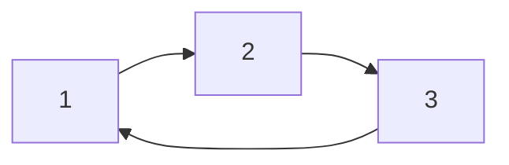
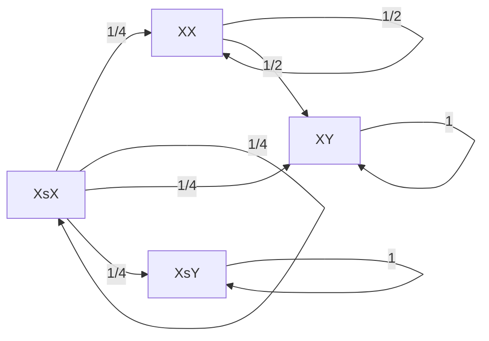

# Problem Sheet 6 - 详细解答 / Detailed Solutions

> MATH2702 Stochastic Processes
> 生成时间 / Generated: 2026-07-17 15:13
> 来源页 / Source Pages: 68-68

---

好的，作为您的大学随机过程课程辅导老师，我将为您提供这份习题集的完整、详细的逐步解答。

---

### Question 1 / 第1题

**Problem / 题目原文:**
Consider a Markov chain (𝑋𝑛) with state space 𝒮 = {1,2,3} and transition matrix
P = ⎛⎜⎝0 1 0
0 0 1
1 0 0⎞⎟⎠.
(a) Draw a transition diagram for this Markov chain. Is it irreducible? Is each state periodic or aperiodic?
(b) What is 𝑚𝑖, the return probability, for each state? What is 𝜇𝑖, the expected return time for each state.
(c) By solving 𝜋 = 𝜋P, find the stationary distribution. Use this to confirm the values of 𝜇𝑖.
(d) For what initial distributions 𝜆 do the limits lim𝑛→∞ ℙ(𝑋𝑛 = 𝑖) exist?
(e) What is the long-run proportion of time spent in each state?

**中文翻译:**
考虑一个马尔可夫链 (𝑋𝑛)，其状态空间 𝒮 = {1,2,3}，转移矩阵为
P = ⎛⎜⎝0 1 0
0 0 1
1 0 0⎞⎟⎠。
(a) 画出该马尔可夫链的转移图。它是不可约的吗？每个状态是周期的还是非周期的？
(b) 每个状态的返回概率 𝑚𝑖 是多少？每个状态的期望返回时间 𝜇𝑖 是多少？
(c) 通过求解 𝜋 = 𝜋P，找到平稳分布。用此来确认 𝜇𝑖 的值。
(d) 对于哪些初始分布 𝜆，极限 lim𝑛→∞ ℙ(𝑋𝑛 = 𝑖) 存在？
(e) 在每个状态上花费的长期时间比例是多少？

**Knowledge Points / 考查知识点:**
- 马尔可夫链的转移图、不可约性、周期性
- 返回概率和期望返回时间
- 平稳分布及其与期望返回时间的关系 (𝜇𝑖 = 1/𝜋𝑖)
- 极限分布的存在性和初始分布的关系
- 遍历定理与长期比例

**Step-by-Step Solution / 逐步解答:**

**(a) Transition Diagram, Irreducibility, and Periodicity / 转移图、不可约性和周期性**

**Step 1: Draw the transition diagram / 画出转移图**
The transition matrix P tells us the probability of moving from state i to state j in one step.
- From state 1: P(1,2) = 1. So, there is a deterministic transition from 1 to 2.
- From state 2: P(2,3) = 1. So, there is a deterministic transition from 2 to 3.
- From state 3: P(3,1) = 1. So, there is a deterministic transition from 3 to 1.

The diagram is a cycle: 1 → 2 → 3 → 1.

**Step 2: Check Irreducibility / 检查不可约性**
A Markov chain is irreducible if all states communicate with each other, meaning there is a path from any state i to any state j.
- From state 1: 1 → 2 → 3. So we can reach 2 and 3.
- From state 2: 2 → 3 → 1. So we can reach 1 and 3.
- From state 3: 3 → 1 → 2. So we can reach 1 and 2.
Since every state can be reached from every other state, the chain is **irreducible**.

**Step 3: Check Periodicity / 检查周期性**
A state i has period d if any return to state i is possible only in steps that are multiples of d. d = gcd{n ≥ 1: P(n)ii > 0}.
- State 1: Returns are possible in 3 steps (1→2→3→1), 6 steps, 9 steps, etc. So the set of return times is {3, 6, 9, ...}. The greatest common divisor of this set is 3. So state 1 has period 3.
- State 2: Returns are possible in 3 steps (2→3→1→2), 6 steps, etc. Period is 3.
- State 3: Returns are possible in 3 steps (3→1→2→3), 6 steps, etc. Period is 3.
Since all states have period d=3 > 1, the chain is **periodic** with period 3.

**(b) Return Probability and Expected Return Time / 返回概率和期望返回时间**

**Step 1: Define and calculate return probability mi / 定义并计算返回概率 mi**
The return probability mi is the probability that the chain, starting from state i, will ever return to state i. For a finite, irreducible Markov chain, all states are recurrent, meaning mi = 1 for all i.
Since the chain is finite and irreducible, all states are positive recurrent. Therefore:
m1 = 1, m2 = 1, m3 = 1.

**Step 2: Define and calculate expected return time μi / 定义并计算期望返回时间 μi**
The expected return time μi is the expected number of steps to return to state i for the first time, starting from i.
For a deterministic cycle of length 3, starting from state 1, we go to 2, then 3, then back to 1. The first return time is exactly 3 steps. Therefore:
μ1 = 3, μ2 = 3, μ3 = 3.

**(c) Stationary Distribution and Confirmation / 平稳分布与确认**

**Step 1: Set up the equations for the stationary distribution / 建立平稳分布的方程**
The stationary distribution π = (π1, π2, π3) satisfies π = πP and ∑i πi = 1.
πP = (π1, π2, π3) ⎛⎜⎝0 1 0
0 0 1
1 0 0⎞⎟⎠ = (π3, π1, π2)
Setting π = πP gives us the system of equations:
π1 = π3  (Equation 1)
π2 = π1  (Equation 2)
π3 = π2  (Equation 3)

**Step 2: Solve the system / 解方程组**
From Equations 1, 2, and 3, we get π1 = π2 = π3.
Let this common value be c. The normalization condition is:
π1 + π2 + π3 = c + c + c = 3c = 1
Therefore, c = 1/3.
The stationary distribution is π = (1/3, 1/3, 1/3).

**Step 3: Confirm the values of μi / 确认 μi 的值**
For an irreducible, positive recurrent Markov chain, the expected return time to state i is μi = 1/πi.
μ1 = 1 / (1/3) = 3
μ2 = 1 / (1/3) = 3
μ3 = 1 / (1/3) = 3
This confirms our earlier calculation.

**(d) Existence of Limits for Initial Distributions / 极限存在的初始分布**

**Step 1: State the theorem / 陈述定理**
For a Markov chain, the limit limn→∞ P(Xn = i) exists if the chain is aperiodic. If the chain is periodic, the limit may not exist for all initial distributions.

**Step 2: Analyze the periodic chain / 分析周期链**
Our chain has period 3. Let's see what happens for different initial distributions.
- If λ = (1, 0, 0) (start in state 1):
  P(Xn = 1) = 1 if n is a multiple of 3, 0 otherwise. This sequence does not converge.
- If λ = (1/3, 1/3, 1/3) (the stationary distribution):
  P(Xn = i) = 1/3 for all n. The limit exists and is 1/3.

**Step 3: General condition / 一般条件**
The limit limn→∞ P(Xn = i) exists if and only if the initial distribution λ is a stationary distribution. This is because the chain is periodic, and the only way for the probabilities to settle down is if they are already constant over time.
For this specific chain, the limit exists **only** when the initial distribution is the stationary distribution λ = (1/3, 1/3, 1/3).

**(e) Long-run Proportion of Time / 长期时间比例**

**Step 1: State the ergodic theorem / 陈述遍历定理**
For an irreducible, positive recurrent Markov chain (regardless of periodicity), the long-run proportion of time spent in state i is equal to the stationary probability πi.

**Step 2: Apply to this chain / 应用于此链**
Since the chain is irreducible and positive recurrent, the long-run proportion of time spent in each state is given by the stationary distribution.
Proportion of time in state 1 = π1 = 1/3
Proportion of time in state 2 = π2 = 1/3
Proportion of time in state 3 = π3 = 1/3

**Final Answer / 最终答案:**
(a) The chain is irreducible and periodic with period 3.
(b) mi = 1 for all i. μi = 3 for all i.
(c) The stationary distribution is π = (1/3, 1/3, 1/3). This confirms μi = 1/πi = 3.
(d) The limit exists only when the initial distribution is the stationary distribution λ = (1/3, 1/3, 1/3).
(e) The long-run proportion of time spent in each state is 1/3.

**Key Insight / 解题要点:**
This is a deterministic periodic cycle. The stationary distribution exists and gives the long-run average behavior, but the limiting probabilities only exist if the chain starts in the stationary distribution itself.

---

### Question 2 / 第2题

**Problem / 题目原文:**
This question is a bit more difficult because the underlying Markov chain needs to be extracted from the biological explanation, once this is done it is more straightforward.
Every person has two chromosomes; each chromosome is a copy of a chromosome from one of the person’s parents. There are two types of chromosome, which are conventionally labelled X and Y. A child born with a Y chromosome is male, while a child with two X chromosomes is female.
Haemophilia is a blood-clotting disorder caused by a defective X chromosome (we will label this as X∗). Females with the defective chromosome (X∗X) will not typically show symptoms of the disease but can pass it on to children – they are “carriers”. Males with the defective chromosome (X∗Y) have the disease and its symptoms.
A medical statistician is studying the progress of the disease through first-born children, starting with a female carrier. The statistician makes the following assumptions: First, each parent has an equal probability of passing either of their chromosomes to their children. Second, the partner of each person in the study does not have a defective X chromosome. Third, no new genetic disorders occur.
(a) Show that we can use a Markov chain to model the progress of the disease under the above assumptions. What is the state space? Draw a transition diagram.
(b) What are the communicating classes in the chain? Is each class positive recurrent, null recurrent, or transient?
(c) Calculate a stationary distribution. Is this the only stationary distribution?
(d) Under this model, what is the limiting probability that, in many generations’ time, a child has haemophilia?

**中文翻译:**
这个问题有点难，因为需要从生物学解释中提取出潜在的马尔可夫链，一旦完成，问题就变得直接了。
每个人都有两条染色体；每条染色体都是来自父母一方的染色体的副本。有两种类型的染色体，通常标记为 X 和 Y。出生时带有 Y 染色体的孩子是男性，而带有两条 X 染色体的孩子是女性。
血友病是一种凝血障碍，由有缺陷的 X 染色体（我们将其标记为 X∗）引起。带有缺陷染色体的女性（X∗X）通常不会表现出疾病症状，但可以将其传给子女——她们是“携带者”。带有缺陷染色体的男性（X∗Y）患有该疾病并表现出症状。
一位医学统计学家正在研究该疾病在头胎子女中的进展，从一名女性携带者开始。统计学家做出以下假设：第一，每个父母将他们的任一条染色体传给子女的概率相等。第二，研究中每个人的伴侣没有缺陷的 X 染色体。第三，不会发生新的遗传疾病。
(a) 证明在上述假设下，我们可以使用马尔可夫链来模拟疾病的进展。状态空间是什么？画出转移图。
(b) 链中的通信类是什么？每个类是正常返、零常返还是瞬过的？
(c) 计算一个平稳分布。这是唯一的平稳分布吗？
(d) 根据此模型，在许多代之后，一个孩子患有血友病的极限概率是多少？

**Knowledge Points / 考查知识点:**
- 从实际问题中提取马尔可夫链模型
- 状态空间的定义
- 通信类、常返性与瞬过性
- 吸收态与吸收马尔可夫链
- 平稳分布的唯一性

**Step-by-Step Solution / 逐步解答:**

**(a) Markov Chain Model, State Space, and Transition Diagram / 马尔可夫链模型、状态空间和转移图**

**Step 1: Define the state / 定义状态**
We are modeling the "progress of the disease through first-born children." The state should represent the genetic status of the first-born child in each generation. Since we start with a female carrier (X∗X), the possible genotypes for a child are:
- Female (XX): Normal female.
- Female Carrier (X∗X): Carrier female.
- Male (XY): Normal male.
- Male with Haemophilia (X∗Y): Affected male.

So, the state space is 𝒮 = {XX, X∗X, XY, X∗Y}. We can also label them as states 1, 2, 3, 4 respectively.

**Step 2: Determine transition probabilities / 确定转移概率**
The mother's genotype determines the probabilities of her child's genotype. The father is always normal (XY), as per assumption 2. The mother passes one of her two chromosomes with equal probability (1/2). The father passes either X or Y with equal probability (1/2).

Let's calculate the probability of each child's genotype given the mother's genotype.

- **If Mother is Normal Female (XX):**
  Mother passes X (prob 1). Father passes X (prob 1/2) or Y (prob 1/2).
  P(Child = XX) = 1 * 1/2 = 1/2
  P(Child = XY) = 1 * 1/2 = 1/2
  P(Child = X∗X) = 0
  P(Child = X∗Y) = 0

- **If Mother is Carrier Female (X∗X):**
  Mother passes X (prob 1/2) or X∗ (prob 1/2). Father passes X (prob 1/2) or Y (prob 1/2).
  P(Child = XX) = P(Mother passes X) * P(Father passes X) = (1/2) * (1/2) = 1/4
  P(Child = X∗X) = P(Mother passes X∗) * P(Father passes X) = (1/2) * (1/2) = 1/4
  P(Child = XY) = P(Mother passes X) * P(Father passes Y) = (1/2) * (1/2) = 1/4
  P(Child = X∗Y) = P(Mother passes X∗) * P(Father passes Y) = (1/2) * (1/2) = 1/4

- **If Mother is Normal Male (XY):**
  This is impossible. A male cannot be a mother. The chain only tracks the mother's genotype. However, the child's genotype determines the next generation's mother. If the child is male (XY or X∗Y), the chain cannot continue because a male cannot be a mother. This means the process stops. In Markov chain terms, these are **absorbing states** or **transient states** that lead to an absorbing state representing "no further generations".
  Let's re-interpret the state as the genotype of the *first-born child* in each generation. The next generation's first-born child's genotype depends on the current child's genotype.
  - If the current child is **Female (XX)**: She is a normal female. Her partner is normal (XY). The next child's probabilities are the same as the "Mother is Normal Female" case.
  - If the current child is **Carrier Female (X∗X)**: She is a carrier. Her partner is normal (XY). The next child's probabilities are the same as the "Mother is Carrier Female" case.
  - If the current child is **Normal Male (XY)**: He is a male. He cannot be a mother. The process stops. We can model this as an absorbing state.
  - If the current child is **Affected Male (X∗Y)**: He is a male. He cannot be a mother. The process stops. We can model this as an absorbing state.

  So, the state space is 𝒮 = {XX, X∗X, XY, X∗Y}. The transition probabilities are:
  From XX: P(XX) = 1/2, P(XY) = 1/2, P(X∗X) = 0, P(X∗Y) = 0.
  From X∗X: P(XX) = 1/4, P(X∗X) = 1/4, P(XY) = 1/4, P(X∗Y) = 1/4.
  From XY: P(XX) = 0, P(X∗X) = 0, P(XY) = 1, P(X∗Y) = 0. (Absorbing state)
  From X∗Y: P(XX) = 0, P(X∗X) = 0, P(XY) = 0, P(X∗Y) = 1. (Absorbing state)

**Step 3: Draw the transition diagram / 画出转移图**

**(b) Communicating Classes and Recurrence/Transience / 通信类与常返/瞬过性**

**Step 1: Identify communicating classes / 识别通信类**
- **Class 1: {XY}**. From XY, you can only go to XY. So it is a closed class. It is an absorbing state.
- **Class 2: {X∗Y}**. From X∗Y, you can only go to X∗Y. So it is a closed class. It is an absorbing state.
- **Class 3: {XX, X∗X}**. From XX, you can go to XX or XY. From X∗X, you can go to XX, X∗X, XY, or X∗Y. You cannot return from XY or X∗Y to XX or X∗X. So this class is not closed. It is a **transient class**.

**Step 2: Determine recurrence/transience / 确定常返/瞬过性**
- **{XY}**: This is a closed class with a single state. It is an absorbing state, so it is **positive recurrent**.
- **{X∗Y}**: This is a closed class with a single state. It is an absorbing state, so it is **positive recurrent**.
- **{XX, X∗X}**: This class is not closed. There is a positive probability of leaving the class and never returning. Therefore, all states in this class are **transient**.

**(c) Stationary Distribution / 平稳分布**

**Step 1: Set up the equations / 建立方程**
A stationary distribution π satisfies π = πP and ∑πi = 1.
Let π = (πXX, πX∗X, πXY, πX∗Y).
πP = (πXX, πX∗X, πXY, πX∗Y) *
⎛⎜⎜⎜⎝1/2  0   1/2  0
1/4 1/4 1/4 1/4
0   0   1   0
0   0   0   1⎞⎟⎟⎟⎠
= ( (1/2)πXX + (1/4)πX∗X, (1/4)πX∗X, (1/2)πXX + (1/4)πX∗X + πXY, (1/4)πX∗X + πX∗Y )

Setting π = πP gives:
πXX = (1/2)πXX + (1/4)πX∗X  (1)
πX∗X = (1/4)πX∗X  (2)
πXY = (1/2)πXX + (1/4)πX∗X + πXY  (3)
πX∗Y = (1/4)πX∗X + πX∗Y  (4)

**Step 2: Solve the equations / 解方程**
From (2): πX∗X = (1/4)πX∗X ⇒ (3/4)πX∗X = 0 ⇒ πX∗X = 0.
From (1): πXX = (1/2)πXX + 0 ⇒ (1/2)πXX = 0 ⇒ πXX = 0.
From (3): πXY = 0 + 0 + πXY ⇒ 0 = 0. This gives no information about πXY.
From (4): πX∗Y = 0 + πX∗Y ⇒ 0 = 0. This gives no information about πX∗Y.

**Step 3: Apply normalization / 应用归一化**
πXX + πX∗X + πXY + πX∗Y = 0 + 0 + πXY + πX∗Y = 1.
So, any distribution of the form π = (0, 0, a, 1-a) for 0 ≤ a ≤ 1 is a stationary distribution.

**Step 4: Uniqueness / 唯一性**
Since there are multiple stationary distributions, the stationary distribution is **not unique**. This is because the chain has multiple closed communicating classes (the two absorbing states).

**(d) Limiting Probability of Haemophilia / 血友病的极限概率**

**Step 1: Interpret the question / 解释问题**
We start with a female carrier (X∗X). We want the probability that, in the long run (many generations), a child has haemophilia (X∗Y). Since the chain will eventually be absorbed into either XY or X∗Y, the limiting probability is the probability of absorption into X∗Y.

**Step 2: Calculate absorption probabilities / 计算吸收概率**
Let fi be the probability of eventually being absorbed into X∗Y, starting from state i.
We want fX∗X.
The equations for absorption probabilities are:
fi = ∑j Pij fj, with boundary conditions fX∗Y = 1, fXY = 0.

For state XX:
fXX = (1/2) fXX + (1/2) fXY = (1/2) fXX + 0
⇒ (1/2) fXX = 0 ⇒ f