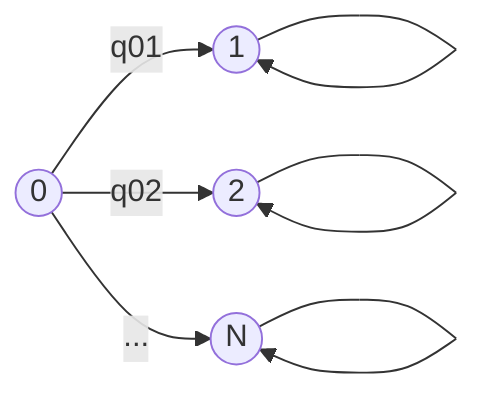

# Problem Sheet 9 - 详细解答 / Detailed Solutions

> MATH2702 Stochastic Processes
> 生成时间 / Generated: 2026-07-20 16:06
> 来源页 / Source Pages: 89-90

---

好的，作为您的大学随机过程数学导师，我将为您提供MATH2702课程问题集9的完整、详细的双语解答。

---

### Question 1 / 第1题

**Problem / 题目原文:**
Consider a Markov jump process with state space 𝒮= {0, 1, 2, … , 𝑁} and generator matrix
Q =
$$
\begin{pmatrix}
−𝑞0 & 𝑞01 & 𝑞02 & ⋯ & 𝑞0𝑁 \\
0 & 0 & 0 & ⋯ & 0 \\
0 & 0 & 0 & ⋯ & 0 \\
⋮ & ⋮ & ⋮ & ⋱ & ⋮ \\
0 & 0 & 0 & ⋯ & 0
\end{pmatrix}
$$
.
(a) Draw a transition rate diagram for this jump process.
This process is a “multiple decrement model”: there is one “active state” 0 and a number of “exit states”
1, 2, … , 𝑁.
(b) What is the probability that the process exits at state 𝑖?
(c) Give a 95% prediction interval for the amount of time spent in the active state. (Your answer will
be in terms of 𝑞0.)

**中文翻译 / Chinese Translation:**
考虑一个状态空间为 𝒮= {0, 1, 2, … , 𝑁}，生成矩阵为
Q =
$$
\begin{pmatrix}
−𝑞0 & 𝑞01 & 𝑞02 & ⋯ & 𝑞0𝑁 \\
0 & 0 & 0 & ⋯ & 0 \\
0 & 0 & 0 & ⋯ & 0 \\
⋮ & ⋮ & ⋮ & ⋱ & ⋮ \\
0 & 0 & 0 & ⋯ & 0
\end{pmatrix}
$$
的马尔可夫跳跃过程。
(a) 画出这个跳跃过程的转移速率图。
这个过程是一个“多重减因模型”：有一个“活跃状态”0和若干个“退出状态”1, 2, … , 𝑁。
(b) 过程在状态𝑖退出的概率是多少？
(c) 给出在活跃状态中停留时间的95%预测区间。（你的答案将用𝑞0表示。）

**Knowledge Points / 考查知识点:**
- 马尔可夫跳跃过程（Markov Jump Process）的生成矩阵（Generator Matrix）和转移速率图（Transition Rate Diagram）。
- 多重减因模型（Multiple Decrement Model）中，从活跃状态到各个吸收状态的转移概率。
- 指数分布（Exponential Distribution）的性质：在活跃状态的停留时间服从参数为总退出速率𝑞0的指数分布。
- 指数分布的预测区间（Prediction Interval）计算。

**Step-by-Step Solution / 逐步解答:**

**(a) Transition Rate Diagram / 转移速率图**

**Step 1: 理解生成矩阵的结构 / Understanding the Structure of the Generator Matrix**

**中文思路 / Chinese reasoning:**
生成矩阵Q的行和必须为0。第一行对应状态0。对角线元素是-𝑞0，其中𝑞0 = Σ_{j=1}^{N} 𝑞0j，即从状态0出发的所有转移速率之和。非对角线元素𝑞0j (j=1,...,N) 是从状态0到状态j的转移速率。其他所有行（状态1到N）都是全零行，这意味着这些状态是吸收态（absorbing states）：一旦进入，就不会再离开。

**English reasoning:**
The rows of the generator matrix Q must sum to zero. The first row corresponds to state 0. The diagonal element is -𝑞0, where 𝑞0 = Σ_{j=1}^{N} 𝑞0j, which is the total rate of leaving state 0. The off-diagonal elements 𝑞0j (j=1,...,N) are the transition rates from state 0 to state j. All other rows (states 1 to N) are entirely zero, which means these states are absorbing: once entered, the process stays there forever.

**Step 2: 绘制速率图 / Drawing the Diagram**

**中文思路 / Chinese reasoning:**
在转移速率图中，我们用圆圈表示状态，用带箭头的弧线表示可能的转移，并在弧线上标注转移速率。从状态0出发，有N条弧线分别指向状态1, 2, ..., N，速率分别为𝑞01, 𝑞02, ..., 𝑞0N。由于状态1到N是吸收态，没有离开它们的弧线。

**English reasoning:**
In a transition rate diagram, we represent states with circles and possible transitions with arrows labeled by their rates. From state 0, there are N arrows pointing to states 1, 2, ..., N, with rates 𝑞01, 𝑞02, ..., 𝑞0N respectively. Since states 1 to N are absorbing, there are no arrows leaving them.

**计算过程 / Working:**

*Note: The self-loops on states 1, 2, ..., N are implied for absorbing states but are not strictly necessary in a rate diagram as they have rate 0.*

**过程解释 / Explanation of working:**
速率图直观地展示了所有可能的转移。状态0是唯一一个可以离开的状态，它按照给定的速率跳转到各个吸收状态。吸收态没有向外的箭头，表示一旦进入，过程就停留在那里。

The rate diagram visually shows all possible transitions. State 0 is the only state from which the process can leave, jumping to each absorbing state at the given rates. Absorbing states have no outgoing arrows, indicating that once entered, the process stays there.

**(b) Probability of Exiting at State i / 在状态i退出的概率**

**Step 1: 识别概率 / Identifying the Probability**

**中文思路 / Chinese reasoning:**
这是一个多重减因模型。过程从状态0开始，最终会跳转到某个吸收状态i。由于在状态0的停留时间服从指数分布，而跳转到哪个状态是由一个独立的“竞争性”指数过程决定的。从状态0跳转到状态i的概率，等于从0到i的转移速率𝑞0i除以从0出发的总转移速率𝑞0。

**English reasoning:**
This is a multiple decrement model. The process starts in state 0 and will eventually jump to one of the absorbing states i. Since the holding time in state 0 is exponentially distributed, and the choice of which state to jump to is determined by independent "competing" exponential processes. The probability of jumping from state 0 to state i is equal to the transition rate from 0 to i, 𝑞0i, divided by the total rate of leaving state 0, 𝑞0.

**计算过程 / Working:**
The probability that the process exits at state i is:
$$P(\text{exit at state } i) = \frac{q_{0i}}{q_0}$$
where $q_0 = \sum_{j=1}^{N} q_{0j}$.

**过程解释 / Explanation of working:**
这个公式是马尔可夫跳跃过程中跳跃概率的标准结果。在状态0，有N个独立的指数时钟在运行，每个时钟的速率为𝑞0i。第一个响起的时钟决定了跳转的目标状态。因此，时钟i最先响起的概率就是𝑞0i / (𝑞01 + 𝑞02 + ... + 𝑞0N) = 𝑞0i / 𝑞0。

This formula is a standard result for jump probabilities in a Markov jump process. In state 0, there are N independent exponential clocks running, each with rate 𝑞0i. The first clock to ring determines the target state of the jump. Therefore, the probability that clock i rings first is 𝑞0i / (𝑞01 + 𝑞02 + ... + 𝑞0N) = 𝑞0i / 𝑞0.

**(c) 95% Prediction Interval for Time in Active State / 在活跃状态停留时间的95%预测区间**

**Step 1: 确定停留时间的分布 / Identifying the Distribution of the Holding Time**

**中文思路 / Chinese reasoning:**
在马尔可夫跳跃过程中，在状态0的停留时间𝑇服从参数为𝑞0的指数分布，即𝑇 ~ Exp(𝑞0)。这是因为从状态0出发的总转移速率为𝑞0，所以离开速率就是𝑞0。

**English reasoning:**
In a Markov jump process, the holding time 𝑇 in state 0 follows an exponential distribution with parameter 𝑞0, i.e., 𝑇 ~ Exp(𝑞0). This is because the total rate of leaving state 0 is 𝑞0.

**Step 2: 寻找预测区间 / Finding the Prediction Interval**

**中文思路 / Chinese reasoning:**
一个95%的预测区间是指，区间覆盖随机变量𝑇的概率为0.95。对于指数分布，我们可以通过其累积分布函数（CDF）来找到这个区间。一个常见的方法是找到分布的下α/2分位数和上α/2分位数，其中α = 0.05。所以我们需要找到𝑡_low和𝑡_high，使得P(𝑇 ≤ 𝑡_low) = 0.025 且 P(𝑇 ≤ 𝑡_high) = 0.975。由于指数分布是右偏的，一个更简单的等尾区间是[0, 𝑡_0.95]，其中𝑡_0.95是95%分位数，即P(𝑇 ≤ 𝑡_0.95) = 0.95。但更标准的做法是使用等尾区间。

**English reasoning:**
A 95% prediction interval is an interval that covers the random variable 𝑇 with probability 0.95. For an exponential distribution, we can find this interval using its cumulative distribution function (CDF). A common approach is to find the lower α/2 and upper α/2 quantiles, where α = 0.05. So we need to find 𝑡_low and 𝑡_high such that P(𝑇 ≤ 𝑡_low) = 0.025 and P(𝑇 ≤ 𝑡_high) = 0.975. Since the exponential distribution is right-skewed, a simpler equal-tailed interval is [0, 𝑡_0.95], where 𝑡_0.95 is the 95th percentile, i.e., P(𝑇 ≤ 𝑡_0.95) = 0.95. However, a more standard approach is to use an equal-tailed interval.

**计算过程 / Working:**
The CDF of an exponential distribution with rate λ is $F(t) = 1 - e^{-λt}$.
We want to find $t_{low}$ and $t_{high}$ such that:
$$P(T \le t_{low}) = 0.025 \quad \text{and} \quad P(T \le t_{high}) = 0.975$$
$$1 - e^{-q_0 t_{low}} = 0.025 \implies e^{-q_0 t_{low}} = 0.975 \implies -q_0 t_{low} = \ln(0.975) \implies t_{low} = -\frac{\ln(0.975)}{q_0}$$
$$1 - e^{-q_0 t_{high}} = 0.975 \implies e^{-q_0 t_{high}} = 0.025 \implies -q_0 t_{high} = \ln(0.025) \implies t_{high} = -\frac{\ln(0.025)}{q_0}$$

**过程解释 / Explanation of working:**
我们使用指数分布的CDF来解出分位数。对于下界，我们设CDF等于0.025；对于上界，设CDF等于0.975。然后解出t。注意，由于指数分布的定义域是[0, ∞)，下界是正数。我们可以计算这些对数值的近似值：ln(0.975) ≈ -0.0253，ln(0.025) ≈ -3.6889。所以，t_low ≈ 0.0253/q0，t_high ≈ 3.6889/q0。

We use the CDF of the exponential distribution to solve for the quantiles. For the lower bound, we set the CDF equal to 0.025; for the upper bound, we set it to 0.975. Then we solve for t. Note that since the exponential distribution is defined on [0, ∞), the lower bound is positive. We can compute approximate values for these logarithms: ln(0.975) ≈ -0.0253, ln(0.025) ≈ -3.6889. So, t_low ≈ 0.0253/q0, t_high ≈ 3.6889/q0.

**Final Answer / 最终答案:**
(a) The transition rate diagram is shown above.
(b) $P(\text{exit at state } i) = \frac{q_{0i}}{q_0}$, where $q_0 = \sum_{j=1}^N q_{0j}$.
(c) A 95% prediction interval for the time spent in the active state is:
$$\left[-\frac{\ln(0.975)}{q_0}, -\frac{\ln(0.025)}{q_0}\right] \approx \left[\frac{0.0253}{q_0}, \frac{3.6889}{q_0}\right]$$

(a) 转移速率图如上所示。
(b) 在状态i退出的概率为 $P(\text{在状态 } i \text{ 退出}) = \frac{q_{0i}}{q_0}$，其中 $q_0 = \sum_{j=1}^N q_{0j}$。
(c) 在活跃状态停留时间的95%预测区间为：
$$\left[-\frac{\ln(0.975)}{q_0}, -\frac{\ln(0.025)}{q_0}\right] \approx \left[\frac{0.0253}{q_0}, \frac{3.6889}{q_0}\right]$$

**Key Insight / 解题要点:**
- 多重减因模型的核心是，从活跃状态到各个吸收状态的转移概率由相对速率决定，而停留时间由总速率决定。
- The core of the multiple decrement model is that the transition probabilities from the active state to each absorbing state are determined by the relative rates, while the holding time is determined by the total rate.
- 预测区间的计算依赖于指数分布的分位数。
- The calculation of the prediction interval relies on the quantiles of the exponential distribution.

---

### Question 2 / 第2题

**Problem / 题目原文:**
Consider the Markov jump process (𝑋(𝑡)) with state space 𝒮= {1, 2, 3} and generator matrix
Q = $$
\begin{pmatrix}
−4 \\
3 \\
1 \\
2 \\
−6 \\
4 \\
1 \\
2 \\
−3
\end{pmatrix}
$$
.
The process begins from the state 𝑋(0) = 1. Let (𝑌𝑛) be the associated Markov jump chain.
(a) Write down the transition matrix R of the jump chain.
(b) What is the expected time of the first jump 𝐽1?
(c) What is the probability the first jump is to state 2?
(d) By conditioning on the first jump, calculate the expected time of the second jump time 𝐽2 = 𝑇1 +𝑇2.
(e) What is the probability that the second jump is to state 2?
(f) What is the probability that the third jump is to state 2?

**中文翻译 / Chinese Translation:**
考虑一个状态空间为 𝒮= {1, 2, 3}，生成矩阵为
Q = $$
\begin{pmatrix}
−4 \\
3 \\
1 \\
2 \\
−6 \\
4 \\
1 \\
2 \\
−3
\end{pmatrix}
$$
的马尔可夫跳跃过程 (𝑋(𝑡))。
过程从状态 𝑋(0) = 1 开始。令 (𝑌𝑛) 为相关的马尔可夫跳跃链。
(a) 写出跳跃链的转移矩阵 R。
(b) 第一次跳跃时间 𝐽1 的期望是多少？
(c) 第一次跳跃到状态2的概率是多少？
(d) 通过对第一次跳跃进行条件期望，计算第二次跳跃时间 𝐽2 = 𝑇1 + 𝑇2 的期望。
(e) 第二次跳跃到状态2的概率是多少？
(f) 第三次跳跃到状态2的概率是多少？

**Knowledge Points / 考查知识点:**
- 马尔可夫跳跃过程（MJP）与嵌入的马尔可夫跳跃链（Embedded Markov Jump Chain）的关系。
- 从生成矩阵Q推导跳跃链转移矩阵R的方法。
- 指数分布停留时间的期望。
- 跳跃概率的计算。
- 通过条件期望（Conditioning on the first jump）计算期望时间。
- 马尔可夫链的n步转移概率（n-step transition probabilities）。

**Step-by-Step Solution / 逐步解答:**

**(a) Transition Matrix R of the Jump Chain / 跳跃链的转移矩阵R**

**Step 1: 理解跳跃链 / Understanding the Jump Chain**

**中文思路 / Chinese reasoning:**
马尔可夫跳跃链 (𝑌𝑛) 记录了过程在每次跳跃后所处的状态。它的转移矩阵R可以通过生成矩阵Q的非对角线元素计算得出。具体来说，从状态i到状态j (i≠j) 的转移概率是 r_{ij} = q_{ij} / q_i，其中 q_i = -q_{ii} 是从状态i出发的总速率。对角线元素 r_{ii} = 0，因为跳跃链不允许停留在原状态（除非是吸收态，但这里没有吸收态）。

**English reasoning:**
The Markov jump chain (𝑌𝑛) records the state of the process after each jump. Its transition matrix R can be calculated from the off-diagonal elements of the generator matrix Q. Specifically, the transition probability from state i to state j (i≠j) is r_{ij} = q_{ij} / q_i, where q_i = -q_{ii} is the total rate of leaving state i. The diagonal elements r_{ii} = 0 because the jump chain does not allow staying in the same state (unless it's an absorbing state, which is not the case here).

**Step 2: 计算每个状态的q_i / Calculating q_i for each state**

**中文思路 / English reasoning:**
从Q的对角线元素，我们得到离开每个状态的总速率。
From the diagonal elements of Q, we get the total rate of leaving each state.

**计算过程 / Working:**
$q_1 = -q_{11} = 4$
$q_2 = -q_{22} = 6$
$q_3 = -q_{33} = 3$

**Step 3: 计算转移概率 / Calculating Transition Probabilities**

**中文思路 / English reasoning:**
对于每个非对角线元素，我们计算 r_{ij} = q_{ij} / q_i。
For each off-diagonal element, we calculate r_{ij} = q_{ij} / q_i.

**计算过程 / Working:**
From state 1:
$r_{12} = \frac{q_{12}}{q_1} = \frac{3}{4}$
$r_{13} = \frac{q_{13}}{q_1} = \frac{1}{4}$

From state 2:
$r_{21} = \frac{q_{21}}{q_2} = \frac{2}{6} = \frac{1}{3}$
$r_{23} = \frac{q_{23}}{q_2} = \frac{4}{6} = \frac{2}{3}$

From state 3:
$r_{31} = \frac{q_{31}}{q_3} = \frac{1}{3}$
$r_{32} = \frac{q_{32}}{q_3} = \frac{2}{3}$

**过程解释 / Explanation of working:**
我们逐行计算。对于状态1，总离开速率是4。转移到状态2的速率是3，所以概率是3/4。转移到状态3的速率是1，所以概率是1/4。对于状态2，总离开速率是6。转移到状态1的速率是2，所以概率是2/6=1/3。转移到状态3的速率是4，所以概率是4/6=2/3。对于状态3，总离开速率是3。转移到状态1的速率是1，所以概率是1/3。转移到状态2的速率是2，所以概率是2/3。

We calculate row by row. For state 1, the total exit rate is 4. The rate of transitioning to state 2 is 3, so the probability is 3/4. The rate of transitioning to state 3 is 1, so the probability is 1/4. For state 2, the total exit rate is 6. The rate of transitioning to state 1 is 2, so the probability is 2/6=1/3. The rate of transitioning to state 3 is 4, so the probability is 4/6=2/3. For state 3, the total exit rate is 3. The rate of transitioning to state 1 is 1, so the probability is 1/3. The rate of transitioning to state 2 is 2, so the probability is 2/3.

**Final Answer for (a) / (a)的最终答案:**
$$R = $$
\begin{pmatrix}
0 & 3/4 & 1/4 \\
1/3 & 0 & 2/3 \\
1/3 & 2/3 & 0
\end{pmatrix}
$$$$

**(b) Expected Time of the First Jump J1 / 第一次跳跃时间J1的期望**

**Step 1: 确定J1的分布 / Identifying the Distribution of J1**

**中文思路 / Chinese reasoning:**
过程从状态1开始。在状态1的停留时间T1服从参数为q1=4的指数分布。第一次跳跃时间J1就是T1。

**English reasoning:**
The process starts in state 1. The holding time T1 in state 1 follows an exponential distribution with parameter q1=4. The first jump time J1 is exactly T1.

**Step 2: 计算期望 / Calculating the Expectation**

**中文思路 / English reasoning:**
指数分布的期望是其参数的倒数。
The expectation of an exponential distribution is the reciprocal of its parameter.

**计算过程 / Working:**
$$E[J_1] = E[T_1] = \frac{1}{q_1} = \frac{1}{4}$$

**Final Answer for (b) / (b)的最终答案:**
$$E[J_1] = \frac{1}{4}$$

**(c) Probability the First Jump is to State 2 / 第一次跳跃到状态2的概率**

**Step 1: 使用跳跃概率 / Using the Jump Probability**

**中文思路 / Chinese reasoning:**
第一次跳跃到状态2的概率，就是跳跃链从状态1到状态2的转移概率，即r_{12}。

**English reasoning:**
The probability that the first jump is to state 2 is exactly the transition probability of the jump chain from state 1 to state 2, which is r_{12}.

**计算过程 / Working:**
$$P(Y_1 = 2 | Y_0 = 1) = r_{12} = \frac{3}{4}$$

**Final Answer for (c) / (c)的最终答案:**
$$P(\text{first jump to state 2}) = \frac{3}{4}$$

**(d) Expected Time of the Second Jump J2 = T1 + T2 / 第二次跳跃时间J2 = T1 + T2的期望**

**Step 1: 使用条件期望 / Using Conditional Expectation**

**中文思路 / Chinese reasoning:**
我们需要计算E[J2] = E[T1 + T2]。我们可以通过对第一次跳跃的结果进行条件期望来计算。J2 = T1 + T2，其中T1是状态1的停留时间，T2是第一次跳跃后到达的状态的停留时间。我们不知道第一次跳到哪里，所以我们需要对所有可能的目标状态进行平均。

**English reasoning:**
We need to calculate E[J2] = E[T1 + T2]. We can do this by conditioning on the outcome of the first jump. J2 = T1 + T2, where T1 is the holding time in state 1, and T2 is the holding time in the state reached after the first jump. We don't know where the first jump goes, so we need to average over all possible target states.

**Step 2: 应用条件期望公式 / Applying the Law of Total Expectation**

**中文思路 / English reasoning:**
根据全期望公式，E[J2] = E[E[J2 | Y1]]。给定第一次跳跃到达的状态Y1，J2 = T1 + T2，其中T1和T2是独立的指数随机变量（因为MJP的马尔可夫性）。所以E[J2 | Y1 = j] = E[T1] + E[T2 | Y1 = j] = 1/q1 + 1/qj。

By the Law of Total Expectation, E[J2] = E[E[J2 | Y1]]. Given the state Y1 reached after the first jump, J2 = T1 + T2, where T1 and T2 are independent exponential random variables (due to the Markov property of the MJP). So E[J2 | Y1 = j] = E[T1] + E[T2 | Y1 = j] = 1/q1 + 1/qj.

**计算过程 / Working:**
$$E[J_2] = E[E[J_2 | Y_1]] = \sum_{j \in \{2,3\}} E[J_2 | Y_1 = j] \cdot P(Y_1 = j | Y_0 = 1)$$
$$E[J_2 | Y_1 = 2] = \frac{1}{q_1} + \frac{1}{q_2} = \frac{1}{4} + \frac{1}{6} = \frac{3}{12} + \frac{2}{12} = \frac{5}{12}$$
$$E[J_2 | Y_1 = 3] = \frac{1}{q_1} + \frac{1}{q_3} = \frac{1}{4} + \frac{1}{3} = \frac{3}{12} + \frac{4}{12} = \frac{7}{12}$$
$$P(Y_1 = 2 | Y_0 = 1) = \frac{3}{4}, \quad P(Y_1 = 3 | Y_0 = 1) = \frac{1}{4}$$
$$E[J_2] = \left(\frac{5}{12}\right) \cdot \frac{3}{4} + \left(\frac{7}{12}\right) \cdot \frac{1}{4} = \frac{15}{48} + \frac{7}{48} = \frac{22}{48} = \frac{11}{24}$$

**过程解释 / Explanation of working:**
我们首先计算了在给定第一次跳跃到状态2或3的条件下，J2的条件期望。然后，