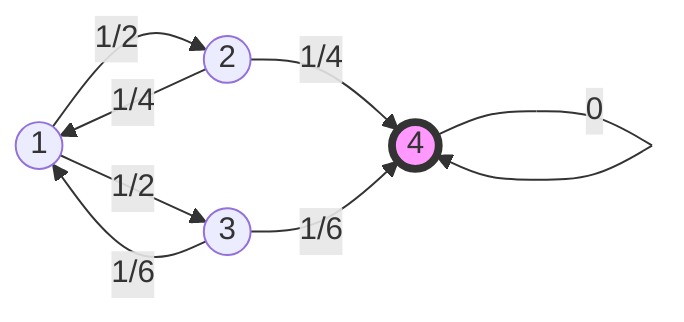

# Problem Sheet 10 - 详细解答 / Detailed Solutions

> MATH2702 Stochastic Processes
> 生成时间 / Generated: 2026-07-20 16:07
> 来源页 / Source Pages: 97-99

---

好的，作为大学数学导师，我将为您提供MATH2702：随机过程习题集10的完整、逐步、双语（中文/英文）解答。

---

### Question 1 / 第1题

**Problem / 题目原文:**
Consider the Markov jump process on 𝒮= {1, 2, 3, 4} with generator matrix
Q =
$$
\begin{pmatrix}
−1 & 1 & 2 & 1 & 2 & 0 \\
1 & 4 & −1 & 2 & 0 & 1 \\
4 & 1 & 6 & 0 & −1 & 3 \\
1 & 6 & 0 & 0 & 0 & 0
\end{pmatrix}
$$
.
(a) Draw a transition rate diagram for this process.
(b) Write down the communicating classes for this process, and state whether they are recurrent or
transient.
(c) Calculate the hitting probability ℎ13.
(d) Calculate the expected hitting time 𝜂14.

**中文翻译 / Chinese Translation:**
考虑一个定义在状态空间 𝒮= {1, 2, 3, 4} 上的马尔可夫跳跃过程，其生成元矩阵为
Q =
$$
\begin{pmatrix}
−1 & 1 & 2 & 1 & 2 & 0 \\
1 & 4 & −1 & 2 & 0 & 1 \\
4 & 1 & 6 & 0 & −1 & 3 \\
1 & 6 & 0 & 0 & 0 & 0
\end{pmatrix}
$$
.
(a) 画出该过程的转移速率图。
(b) 写出该过程的通信类，并说明它们是常返的还是瞬时的。
(c) 计算击中概率 ℎ13。
(d) 计算期望击中时间 𝜂14。

**Knowledge Points / 考查知识点:**
- 马尔可夫跳跃过程 (Markov Jump Process, MJP) 的生成元矩阵 (Generator Matrix) 和转移速率图 (Transition Rate Diagram)。
- 通信类 (Communicating Classes) 的分类：常返 (Recurrent) 与瞬时 (Transient)。
- 击中概率 (Hitting Probability) 的计算，通过求解线性方程组。
- 期望击中时间 (Expected Hitting Time) 的计算，通过求解线性方程组。

**Step-by-Step Solution / 逐步解答:**

#### Part (a) / 第(a)部分

**Step 1: 解析生成元矩阵 / Parse the Generator Matrix**

**中文思路 / Chinese reasoning:**
首先，我们需要理解生成元矩阵 Q 的结构。Q 是一个 4x4 矩阵，其元素 \( q_{ij} \) 表示从状态 i 到状态 j 的转移速率。对角线元素 \( q_{ii} \) 是负的，并且等于该行所有非对角线元素之和的相反数，即 \( q_{ii} = -\sum_{j \neq i} q_{ij} \)。我们从矩阵中提取出所有非零的转移速率。

**English reasoning:**
First, we need to understand the structure of the generator matrix Q. Q is a 4x4 matrix, where the element \( q_{ij} \) represents the transition rate from state i to state j. The diagonal elements \( q_{ii} \) are negative and equal to the negative sum of all off-diagonal elements in that row, i.e., \( q_{ii} = -\sum_{j \neq i} q_{ij} \). We extract all non-zero transition rates from the matrix.

**计算过程 / Working:**
从矩阵 Q 中，我们可以读出非零的转移速率：
- 从状态 1: \( q_{12} = \frac{1}{2} \), \( q_{13} = \frac{1}{2} \). 对角线 \( q_{11} = -1 \)，验证：\( -(\frac{1}{2} + \frac{1}{2}) = -1 \)，正确。
- 从状态 2: \( q_{21} = \frac{1}{4} \), \( q_{24} = \frac{1}{4} \). 对角线 \( q_{22} = -\frac{1}{2} \)，验证：\( -(\frac{1}{4} + \frac{1}{4}) = -\frac{1}{2} \)，正确。
- 从状态 3: \( q_{31} = \frac{1}{6} \), \( q_{34} = \frac{1}{6} \). 对角线 \( q_{33} = -\frac{1}{3} \)，验证：\( -(\frac{1}{6} + \frac{1}{6}) = -\frac{1}{3} \)，正确。
- 从状态 4: 所有非对角线元素都是 0，所以 \( q_{41} = q_{42} = q_{43} = 0 \). 对角线 \( q_{44} = 0 \)。这意味着状态 4 是一个吸收态 (absorbing state)。

**Explanation of working / 过程解释:**
我们逐行检查了矩阵 Q。对于每一行 i，非对角线元素 \( q_{ij} \) (i ≠ j) 给出了从状态 i 跳到状态 j 的速率。对角线元素 \( q_{ii} \) 是负的，其绝对值是离开状态 i 的总速率。状态 4 的行全为零，意味着一旦进入状态 4，就永远不会离开，因此它是吸收态。

**Step 2: 绘制转移速率图 / Draw the Transition Rate Diagram**

**中文思路 / Chinese reasoning:**
根据上一步提取的速率，我们可以画出转移速率图。每个状态用一个圆圈表示，状态之间的箭头表示可能的转移，箭头上标注的是转移速率 \( q_{ij} \)。对于吸收态 4，没有离开它的箭头。

**English reasoning:**
Based on the rates extracted in the previous step, we can draw the transition rate diagram. Each state is represented by a circle, arrows between states indicate possible transitions, and the arrows are labeled with the transition rates \( q_{ij} \). For the absorbing state 4, there are no arrows leaving it.

**计算过程 / Working:**
转移速率图如下：

**Explanation of working / 过程解释:**
图中，状态 1 有两条离开的箭头，分别指向状态 2 和状态 3，速率均为 1/2。状态 2 有两条离开的箭头，分别指向状态 1 和状态 4，速率均为 1/4。状态 3 有两条离开的箭头，分别指向状态 1 和状态 4，速率均为 1/6。状态 4 没有离开的箭头，表示它是一个吸收态。注意，我们通常不画从状态到自身的箭头，因为其速率由对角线元素表示。

#### Part (b) / 第(b)部分

**Step 1: 识别通信类 / Identify Communicating Classes**

**中文思路 / Chinese reasoning:**
通信类是一组可以相互到达的状态集合。我们需要分析状态之间的可达性。从转移速率图可以看出，状态 1、2、3 之间可以相互到达（例如 1→2, 2→1, 1→3, 3→1, 2→4 但 4 不能回到 2，所以 2 和 4 不在同一个类）。状态 4 只能从其他状态进入，但无法离开，所以它自己构成一个通信类。

**English reasoning:**
A communicating class is a set of states that can all reach each other. We need to analyze the reachability between states. From the transition rate diagram, we can see that states 1, 2, and 3 can all reach each other (e.g., 1→2, 2→1, 1→3, 3→1, 2→4 but 4 cannot return to 2, so 2 and 4 are not in the same class). State 4 can only be entered from other states but cannot leave, so it forms a communicating class by itself.

**计算过程 / Working:**
- 类 1: {1, 2, 3}。因为 1↔2, 1↔3, 2→1, 3→1, 2→3? 没有直接箭头，但可以通过 1 到达：2→1→3。同样，3→1→2。所以它们相互可达。
- 类 2: {4}。从 4 不能到达任何其他状态，所以它自己是一个类。

**Explanation of working / 过程解释:**
我们检查了每对状态之间的路径。对于状态 1、2、3，尽管没有直接的相互箭头，但可以通过中间状态（如状态 1）实现相互到达。状态 4 是一个吸收态，一旦进入就无法离开，因此它自己构成一个封闭的通信类。

**Step 2: 判断常返性与瞬变性 / Determine Recurrence and Transience**

**中文思路 / Chinese reasoning:**
在一个有限状态空间的马尔可夫跳跃过程中，一个通信类是常返的当且仅当它是闭集 (closed set)，即从该类中的任何状态出发，都无法到达该类之外的状态。否则，该类是瞬时的。对于类 {1, 2, 3}，从这些状态可以跳到状态 4（例如 2→4, 3→4），这意味着该类不是闭集，因此是瞬时的。对于类 {4}，它是一个吸收态，从它出发无法到达任何其他状态，因此它是一个闭集，并且是常返的（实际上是正常返的，因为状态有限）。

**English reasoning:**
In a Markov jump process with a finite state space, a communicating class is recurrent if and only if it is a closed set, meaning that from any state in the class, it is impossible to reach a state outside the class. Otherwise, the class is transient. For class {1, 2, 3}, from these states, it is possible to jump to state 4 (e.g., 2→4, 3→4), meaning the class is not closed, and therefore it is transient. For class {4}, it is an absorbing state, and from it, no other state can be reached, so it is a closed set and is recurrent (in fact, positive recurrent because the state space is finite).

**计算过程 / Working:**
- 类 {1, 2, 3}: 不是闭集 (因为存在离开的箭头指向状态 4) → **瞬时 (Transient)**。
- 类 {4}: 是闭集 (没有离开的箭头) → **常返 (Recurrent)**。

**Explanation of working / 过程解释:**
判断的关键在于该类是否“封闭”。类 {1, 2, 3} 有离开的箭头指向状态 4，所以不是封闭的，因此是瞬时的。这意味着从该类出发，过程最终会以概率 1 离开并进入状态 4。类 {4} 是封闭的，因此是常返的。

#### Part (c) / 第(c)部分

**Step 1: 建立击中概率方程 / Set up the Hitting Probability Equations**

**中文思路 / Chinese reasoning:**
\( h_{13} \) 表示从状态 1 出发，最终击中（到达）状态 3 的概率。注意，状态 3 是目标状态，状态 4 是吸收态。我们需要求解一个线性方程组。对于任何非吸收态的状态 i，击中概率 \( h_{i3} \) 满足一个方程，该方程基于“第一次跳跃后的状态”进行条件期望。对于吸收态，击中概率是确定的。

**English reasoning:**
\( h_{13} \) represents the probability, starting from state 1, of eventually hitting (reaching) state 3. Note that state 3 is the target state, and state 4 is an absorbing state. We need to solve a system of linear equations. For any non-absorbing state i, the hitting probability \( h_{i3} \) satisfies an equation based on conditioning on the state after the first jump. For absorbing states, the hitting probability is deterministic.

**计算过程 / Working:**
设 \( h_i = \mathbb{P}(\text{hit state 3 starting from state } i) \)。对于状态 3，\( h_3 = 1 \)。对于状态 4，\( h_4 = 0 \)（因为从 4 出发无法到达 3）。
对于状态 i (i ≠ 3, 4)，我们有：
\[
h_i = \sum_{j \neq i} \frac{q_{ij}}{-q_{ii}} h_j
\]
其中 \( \frac{q_{ij}}{-q_{ii}} \) 是从状态 i 出发，下一次跳跃跳到状态 j 的概率。

对于状态 1:
\( -q_{11} = 1 \), \( q_{12} = 1/2 \), \( q_{13} = 1/2 \).
所以 \( h_1 = \frac{1/2}{1} h_2 + \frac{1/2}{1} h_3 = \frac{1}{2} h_2 + \frac{1}{2} \cdot 1 = \frac{1}{2} h_2 + \frac{1}{2} \).

对于状态 2:
\( -q_{22} = 1/2 \), \( q_{21} = 1/4 \), \( q_{24} = 1/4 \).
所以 \( h_2 = \frac{1/4}{1/2} h_1 + \frac{1/4}{1/2} h_4 = \frac{1/2}{1} h_1 + \frac{1/2}{1} \cdot 0 = \frac{1}{2} h_1 \).

**Explanation of working / 过程解释:**
我们为每个非吸收态（1 和 2）建立了方程。方程的核心思想是：从状态 i 出发，第一次跳跃会以概率 \( q_{ij}/-q_{ii} \) 跳到状态 j，之后从状态 j 出发击中状态 3 的概率是 \( h_j \)。因此，\( h_i \) 是所有这些可能性的加权平均。对于状态 3，我们直接知道 \( h_3 = 1 \)；对于吸收态 4，\( h_4 = 0 \)。

**Step 2: 求解方程组 / Solve the System of Equations**

**中文思路 / Chinese reasoning:**
现在我们有两个方程和两个未知数 \( h_1 \) 和 \( h_2 \)。我们可以通过代入法求解。

**English reasoning:**
We now have two equations with two unknowns \( h_1 \) and \( h_2 \). We can solve them by substitution.

**计算过程 / Working:**
我们有：
(1) \( h_1 = \frac{1}{2} h_2 + \frac{1}{2} \)
(2) \( h_2 = \frac{1}{2} h_1 \)

将 (2) 代入 (1):
\( h_1 = \frac{1}{2} (\frac{1}{2} h_1) + \frac{1}{2} \)
\( h_1 = \frac{1}{4} h_1 + \frac{1}{2} \)
\( h_1 - \frac{1}{4} h_1 = \frac{1}{2} \)
\( \frac{3}{4} h_1 = \frac{1}{2} \)
\( h_1 = \frac{1}{2} \times \frac{4}{3} = \frac{2}{3} \).

**Explanation of working / 过程解释:**
我们通过代入法解这个简单的线性方程组。首先将方程 (2) 代入方程 (1)，得到关于 \( h_1 \) 的一元一次方程。然后移项、合并同类项，最后解出 \( h_1 = 2/3 \)。

**Final Answer / 最终答案:**
\[
\boxed{h_{13} = \frac{2}{3}}
\]
从状态 1 出发，最终击中状态 3 的概率是 2/3。
The probability of hitting state 3 starting from state 1 is 2/3.

#### Part (d) / 第(d)部分

**Step 1: 建立期望击中时间方程 / Set up the Expected Hitting Time Equations**

**中文思路 / Chinese reasoning:**
\( \eta_{14} \) 表示从状态 1 出发，最终击中（到达）状态 4 的期望时间。状态 4 是吸收态。我们需要为所有非吸收态（1, 2, 3）建立方程。方程基于“第一次跳跃的时间”和“第一次跳跃后的状态”进行条件期望。

**English reasoning:**
\( \eta_{14} \) represents the expected time, starting from state 1, to eventually hit (reach) state 4. State 4 is an absorbing state. We need to set up equations for all non-absorbing states (1, 2, 3). The equations are based on conditioning on the time of the first jump and the state after the first jump.

**计算过程 / Working:**
设 \( \eta_i = \mathbb{E}[\text{time to hit state 4 starting from state } i] \)。对于状态 4，\( \eta_4 = 0 \)。

对于状态 i (i ≠ 4)，我们有：
\[
\eta_i = \frac{1}{-q_{ii}} + \sum_{j \neq i} \frac{q_{ij}}{-q_{ii}} \eta_j
\]
其中 \( \frac{1}{-q_{ii}} \) 是在状态 i 的期望逗留时间，\( \frac{q_{ij}}{-q_{ii}} \) 是下一次跳跃跳到状态 j 的概率。

对于状态 1:
\( -q_{11} = 1 \), \( q_{12} = 1/2 \), \( q_{13} = 1/2 \).
\( \eta_1 = \frac{1}{1} + \frac{1/2}{1} \eta_2 + \frac{1/2}{1} \eta_3 = 1 + \frac{1}{2} \eta_2 + \frac{1}{2} \eta_3 \).

对于状态 2:
\( -q_{22} = 1/2 \), \( q_{21} = 1/4 \), \( q_{24} = 1/4 \).
\( \eta_2 = \frac{1}{1/2} + \frac{1/4}{1/2} \eta_1 + \frac{1/4}{1/2} \eta_4 = 2 + \frac{1/2}{1} \eta_1 + \frac{1/2}{1} \cdot 0 = 2 + \frac{1}{2} \eta_1 \).

对于状态 3:
\( -q_{33} = 1/3 \), \( q_{31} = 1/6 \), \( q_{34} = 1/6 \).
\( \eta_3 = \frac{1}{1/3} + \frac{1/6}{1/3} \eta_1 + \frac{1/6}{1/3} \eta_4 = 3 + \frac{1/2}{1} \eta_1 + \frac{1/2}{1} \cdot 0 = 3 + \frac{1}{2} \eta_1 \).

**Explanation of working / 过程解释:**
我们为每个非吸收态建立了方程。方程的核心思想是：从状态 i 出发，首先会在该状态停留一段期望时间为 \( 1/(-q_{ii}) \) 的时间，然后以概率 \( q_{ij}/-q_{ii} \) 跳到状态 j，之后从状态 j 出发击中状态 4 的期望时间是 \( \eta_j \)。因此，总的期望时间是停留时间加上后续期望时间的加权平均。

**Step 2: 求解方程组 / Solve the System of Equations**

**中文思路 / Chinese reasoning:**
现在我们有一个包含三个方程和三个未知数 \( \eta_1, \eta_2, \eta_3 \) 的线性方程组。我们可以通过代入法逐步求解。

**English reasoning:**
We now have a system of three equations with three unknowns \( \eta_1, \eta_2, \eta_3 \). We can solve them step by step using substitution.

**计算过程 / Working:**
我们有：
(1) \( \eta_1 = 1 + \frac{1}{2} \eta_2 + \frac{1}{2} \eta_3 \)
(2) \( \eta_2 = 2 + \frac{1}{2} \eta_1 \)
(3) \( \eta_3 = 3 + \frac{1}{2} \eta_1 \)

将 (2) 和 (3) 代入 (1):
\( \eta_1 = 1 + \frac{1}{2} (2 + \frac{1}{2} \eta_1) + \frac{1}{2} (3 + \frac{1}{2} \eta_1) \)
\( \eta_1 = 1 + 1 + \frac{1}{4} \eta_1 + \frac{3}{2} + \frac{1}{4} \eta_1 \)
\( \eta_1 = (1 + 1 + 1.5) + (\frac{1}{4} + \frac{1}{4}) \eta_1 \)
\( \eta_1 = 3.5 + \frac{1}{2} \eta_1 \)
\( \eta_1 - \frac{1}{2} \eta_1 = 3.5 \)
\( \frac{1}{2} \eta_1 = \frac{7}{2} \)
\( \eta_1 = 7 \).

**Explanation of working / 过程解释:**
我们首先将方程 (2) 和 (3) 代入方程 (1)，消去 \( \eta_2 \) 和 \( \eta_3 \)。然后合并常数项和 \( \eta_1 \) 的系数项，得到一个关于 \( \eta_1 \) 的一元一次方程。最后解出 \( \eta_1 = 7 \)。

**Final Answer / 最终答案:**
\[
\boxed{\eta_{14} = 7}
\]
从状态 1 出发，最终击中状态 4 的期望时间是 7 个单位时间。
The expected time to hit state 4 starting from state 1 is 7 time units.

**Key Insight / 解题要点:**
- 对于击中概率和期望击中时间，关键在于为每个非吸收态建立基于“第一次跳跃”的条件期望方程。The key for hitting probabilities and expected hitting times is to set up conditional expectation equations based on the "first jump" for each non-absorbing state.
- 吸收态是边界条件，其值为 0（对于概率和时间）。Absorbing states provide boundary conditions, with values of 0 (for both probability and time).

---

### Question 2 / 第2题

**Problem / 题目原文:**
Consider a Markov jump process (𝑋(𝑡)) on a triangle, with the vertices labelled 1, 2, 3 going clockwise.
In a short time period 𝜏, we move one step clockwise with probability 𝛼𝜏+ 𝑜(𝜏), one step anticlockwise
with probability 𝛽𝜏+ 𝑜(𝜏), or stay where we are.
(a) Write down a generator matrix for this Markov jump process, and draw a transition rate diagram.
(b) What is the probability, starting from state 1, that we hit state 3 before state 2?
(c) What is the expected time 𝜂13 to hit state 3 starting from state 1.
(d) Write down the transition matrix R for the jump chain (𝑌𝑛).
(e) What is the probability in the jump chain (𝑌𝑛) that, starting from state 1, that we hit state 3 before
state 2?
(f) What is the expected number of steps in the jump chain (𝑌𝑛) to hit state 3 starting from state 1.

**中文翻译 / Chinese Translation:**
考虑一个定义在三角形上的马尔可夫跳跃过程 (𝑋(𝑡))，顶点按顺时针方向标记为 1, 2, 3。
在一个短时间间隔 𝜏 内，我们以概率 𝛼𝜏+ 𝑜(𝜏) 顺时针移动一步，以概率 𝛽𝜏+ 𝑜(𝜏) 逆时针移动一步，或者停留在原地。
(a) 写出这个马尔可夫跳跃过程的生成元矩阵，并画出转移速率图。
(b) 从状态 1 出发，我们在击中状态 3 之前先击中状态 2 的概率是多少？
(c) 从状态 1 出发，击中状态 3 的期望时间 𝜂13 是多少？
(d) 写出跳跃链 (𝑌𝑛) 的转移矩阵 R。
(e) 在跳跃链 (𝑌𝑛) 中，从状态 1 出发，我们在击中状态 3 之前先击中状态 2 的概率是多少？
(f) 在跳跃链 (𝑌𝑛) 中，从状态 1 出发，击中状态 3 的期望步数是多少？

**Knowledge Points / 考查知识点:**
- 从跳跃过程的无穷小定义推导生成元矩阵 (Deriving the generator matrix from infinitesimal definitions)。
- 马尔可夫跳跃过程中的击中概率 (Hitting probabilities in MJP)。
- 马尔可夫跳跃过程中的期望击中时间 (Expected hitting times in MJP)。
- 跳跃链 (Jump Chain) 及其转移矩阵 (Transition Matrix)。
- 离散时间马尔可夫链中的击中概率和期望步数 (Hitting probabilities and expected steps in DTMC)。

**Step-by-Step Solution / 逐步解答:**

#### Part (a) / 第(a)部分

**Step 1: 推导生成元矩阵 / Derive the Generator Matrix**

**中文思路 / Chinese reasoning:**
生成元矩阵 Q 的元素 \( q_{ij} \) 定义为从状态 i 到状态 j 的瞬时转移速率。根据定义，对于 i ≠ j，\( q_{ij} = \lim_{\tau \to 0} \frac{\mathbb{P}(X(\tau) = j | X(0) = i)}{\tau} \)。题目给出了在短时间 τ 内的转移概率，我们可以从中提取出速率。对角线元素 \( q_{ii} = -\sum_{j \neq i} q_{ij} \)。

**English reasoning:**
The elements of the generator matrix Q, \( q_{ij} \), are defined as the instantaneous transition rates from state i to state j. By definition, for i ≠ j, \( q_{ij} = \lim_{\tau \to 0} \frac{\mathbb{P}(X(\tau) = j | X(0) = i