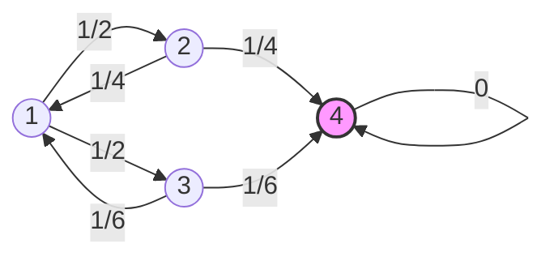
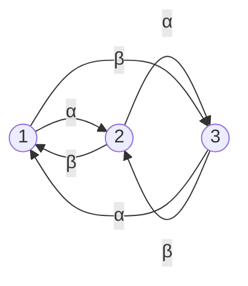

# Problem Sheet 10 - 详细解答 / Detailed Solutions

> MATH2702 Stochastic Processes
> 生成时间 / Generated: 2026-07-17 15:16
> 来源页 / Source Pages: 97-99

---

好的，作为您的大学随机过程课程导师，我将为您提供这份习题集的完整、详细的逐步解答。

---
### Question 1 / 第1题

**Problem / 题目原文:**
Consider the Markov jump process on 𝒮 = {1,2,3,4} with generator matrix
Q = ⎛⎜⎜⎜⎝
-1   1/2  1/2  0
1/4 -1/2  0    1/4
1/6  0   -1/3  1/6
0    0    0    0
⎞⎟⎟⎟⎠.

(a) Draw a transition rate diagram for this process.
(b) Write down the communicating classes for this process, and state whether they are recurrent or transient.
(c) Calculate the hitting probability ℎ₁₃.
(d) Calculate the expected hitting time 𝜂₁₄.

**中文翻译:**
考虑一个定义在状态空间 𝒮 = {1,2,3,4} 上的马尔可夫跳跃过程，其生成元矩阵为：
Q = ⎛⎜⎜⎜⎝
-1   1/2  1/2  0
1/4 -1/2  0    1/4
1/6  0   -1/3  1/6
0    0    0    0
⎞⎟⎟⎟⎠.

(a) 画出该过程的转移速率图。
(b) 写出该过程的通信类，并说明它们是常返的还是瞬时的。
(c) 计算击中概率 ℎ₁₃。
(d) 计算期望击中时间 𝜂₁₄。

**Knowledge Points / 考查知识点:**
- 马尔可夫跳跃过程的生成元矩阵 (Generator Matrix) 与转移速率图 (Transition Rate Diagram)
- 通信类 (Communicating Classes) 的分类：常返 (Recurrent) 与瞬时 (Transient)
- 吸收状态 (Absorbing State)
- 击中概率 (Hitting Probability) 的求解，通过解线性方程组
- 期望击中时间 (Expected Hitting Time) 的求解，通过解线性方程组

**Step-by-Step Solution / 逐步解答:**

**(a) Transition Rate Diagram / 转移速率图**

**Step 1: Interpret the Generator Matrix / 解读生成元矩阵**
生成元矩阵 Q 的每个非对角元素 $q_{ij}$ (其中 $i \neq j$) 表示从状态 $i$ 到状态 $j$ 的转移速率。对角元素 $q_{ii}$ 是行和取负，即 $q_{ii} = -\sum_{j \neq i} q_{ij}$，它表示离开状态 $i$ 的总速率。

**Step 2: Extract Transition Rates / 提取转移速率**
从矩阵 Q 中，我们可以提取出所有非零的转移速率：
- 从状态 1: $q_{12} = 1/2$, $q_{13} = 1/2$。离开速率 $q_1 = -q_{11} = 1$。
- 从状态 2: $q_{21} = 1/4$, $q_{24} = 1/4$。离开速率 $q_2 = -q_{22} = 1/2$。
- 从状态 3: $q_{31} = 1/6$, $q_{34} = 1/6$。离开速率 $q_3 = -q_{33} = 1/3$。
- 从状态 4: 所有 $q_{4j} = 0$ (对于 $j \neq 4$)。这意味着状态 4 是一个吸收状态 (absorbing state)，一旦进入就永远无法离开。

**Step 3: Draw the Diagram / 画出速率图**
根据这些速率，我们可以画出转移速率图。每个状态用一个圆圈表示，箭头表示可能的转移，箭头上的数字表示转移速率。

*(注：状态4是吸收态，通常用特殊标记表示。)*

**(b) Communicating Classes / 通信类**

**Step 1: Define Communicating Classes / 定义通信类**
通信类是一组状态，它们之间可以相互到达。我们需要分析状态之间的可达性。

**Step 2: Analyze Reachability / 分析可达性**
- 状态 1, 2, 3 之间可以相互到达：
  - 1 → 2, 1 → 3
  - 2 → 1
  - 3 → 1
  - 因此，{1, 2, 3} 是一个通信类。
- 状态 4 只能从状态 2 或 3 进入，但一旦进入就无法离开（因为 $q_{4j}=0$ 对所有 $j \neq 4$）。所以状态 4 自身构成一个通信类 {4}。

**Step 3: Classify as Recurrent or Transient / 分类为常返或瞬时**
- 对于通信类 {1, 2, 3}：由于存在离开这个类到状态 4 的转移（例如，从 2 到 4，从 3 到 4），一旦离开，就无法返回。因此，这个类中的状态是**瞬时的 (transient)**。
- 对于通信类 {4}：这是一个吸收状态。一旦进入，就永远停留在该状态。因此，这个类中的状态是**常返的 (recurrent)**，并且是**正常返的 (positive recurrent)**，因为它是吸收态，返回时间确定。

**Final Answer for (b):**
- Communicating classes: {1, 2, 3} (transient), {4} (recurrent/absorbing).

**(c) Hitting Probability ℎ₁₃ / 击中概率 ℎ₁₃**

**Step 1: Define the Hitting Probability / 定义击中概率**
$h_{13}$ 表示从状态 1 出发，最终击中（到达）状态 3 的概率。注意，这里我们关心的是在到达吸收状态 4 之前击中状态 3 的概率。

**Step 2: Set Up Equations / 建立方程**
对于任何状态 $i$，击中概率 $h_i$ 满足以下方程：
$$h_i = \sum_{j \in \mathcal{S}} \frac{q_{ij}}{q_i} h_j$$
其中 $q_i = -q_{ii}$ 是离开状态 $i$ 的总速率。这个方程的含义是：从状态 $i$ 出发，第一次跳跃后到达状态 $j$ 的概率是 $q_{ij}/q_i$，然后从状态 $j$ 出发击中目标状态的概率是 $h_j$。

对于我们的问题，目标状态是 3，吸收状态是 4。我们有边界条件：
- $h_3 = 1$ (从目标状态出发，击中自身的概率为 1)
- $h_4 = 0$ (从吸收状态出发，无法击中其他状态)

**Step 3: Write Equations for Each State / 为每个状态写出方程**
- 状态 1: $q_1 = 1$。方程：$h_1 = \frac{1/2}{1} h_2 + \frac{1/2}{1} h_3 = \frac{1}{2}h_2 + \frac{1}{2}(1)$
- 状态 2: $q_2 = 1/2$。方程：$h_2 = \frac{1/4}{1/2} h_1 + \frac{1/4}{1/2} h_4 = \frac{1}{2}h_1 + \frac{1}{2}(0) = \frac{1}{2}h_1$
- 状态 3: $h_3 = 1$ (边界条件)
- 状态 4: $h_4 = 0$ (边界条件)

**Step 4: Solve the System of Equations / 解方程组**
我们有：
(1) $h_1 = \frac{1}{2}h_2 + \frac{1}{2}$
(2) $h_2 = \frac{1}{2}h_1$

将方程 (2) 代入方程 (1)：
$h_1 = \frac{1}{2}(\frac{1}{2}h_1) + \frac{1}{2} = \frac{1}{4}h_1 + \frac{1}{2}$
移项得：$h_1 - \frac{1}{4}h_1 = \frac{1}{2}$
$\frac{3}{4}h_1 = \frac{1}{2}$
$h_1 = \frac{1}{2} \times \frac{4}{3} = \frac{2}{3}$

**Final Answer for (c):**
$$h_{13} = \frac{2}{3}$$

**(d) Expected Hitting Time 𝜂₁₄ / 期望击中时间 𝜂₁₄**

**Step 1: Define the Expected Hitting Time / 定义期望击中时间**
$\eta_{14}$ 表示从状态 1 出发，最终被吸收到状态 4 的期望时间。注意，状态 4 是唯一的吸收状态，所以最终一定会被吸收。

**Step 2: Set Up Equations / 建立方程**
对于任何状态 $i$，期望击中时间 $\eta_i$ 满足以下方程：
$$\eta_i = \frac{1}{q_i} + \sum_{j \neq i} \frac{q_{ij}}{q_i} \eta_j$$
这个方程的含义是：从状态 $i$ 出发，在第一次跳跃之前，平均停留时间是 $1/q_i$。然后，以概率 $q_{ij}/q_i$ 跳到状态 $j$，并从状态 $j$ 出发，剩余的平均击中时间是 $\eta_j$。

对于吸收状态，我们有边界条件：
- $\eta_4 = 0$ (从吸收状态出发，被吸收的时间为 0)

**Step 3: Write Equations for Each State / 为每个状态写出方程**
- 状态 1: $q_1 = 1$。方程：$\eta_1 = \frac{1}{1} + \frac{1/2}{1} \eta_2 + \frac{1/2}{1} \eta_3 = 1 + \frac{1}{2}\eta_2 + \frac{1}{2}\eta_3$
- 状态 2: $q_2 = 1/2$。方程：$\eta_2 = \frac{1}{1/2} + \frac{1/4}{1/2} \eta_1 + \frac{1/4}{1/2} \eta_4 = 2 + \frac{1}{2}\eta_1 + \frac{1}{2}(0) = 2 + \frac{1}{2}\eta_1$
- 状态 3: $q_3 = 1/3$。方程：$\eta_3 = \frac{1}{1/3} + \frac{1/6}{1/3} \eta_1 + \frac{1/6}{1/3} \eta_4 = 3 + \frac{1}{2}\eta_1 + \frac{1}{2}(0) = 3 + \frac{1}{2}\eta_1$
- 状态 4: $\eta_4 = 0$ (边界条件)

**Step 4: Solve the System of Equations / 解方程组**
我们有：
(1) $\eta_1 = 1 + \frac{1}{2}\eta_2 + \frac{1}{2}\eta_3$
(2) $\eta_2 = 2 + \frac{1}{2}\eta_1$
(3) $\eta_3 = 3 + \frac{1}{2}\eta_1$

将方程 (2) 和 (3) 代入方程 (1)：
$\eta_1 = 1 + \frac{1}{2}(2 + \frac{1}{2}\eta_1) + \frac{1}{2}(3 + \frac{1}{2}\eta_1)$
$\eta_1 = 1 + (1 + \frac{1}{4}\eta_1) + (\frac{3}{2} + \frac{1}{4}\eta_1)$
$\eta_1 = 1 + 1 + \frac{3}{2} + \frac{1}{4}\eta_1 + \frac{1}{4}\eta_1$
$\eta_1 = \frac{7}{2} + \frac{1}{2}\eta_1$
移项得：$\eta_1 - \frac{1}{2}\eta_1 = \frac{7}{2}$
$\frac{1}{2}\eta_1 = \frac{7}{2}$
$\eta_1 = 7$

**Final Answer for (d):**
$$\eta_{14} = 7$$

**Key Insight / 解题要点:**
对于有吸收态的马尔可夫链，击中概率和期望击中时间可以通过解一组线性方程来求得，这些方程基于“第一次跳跃”后的状态进行条件化。

---
### Question 2 / 第2题

**Problem / 题目原文:**
Consider a Markov jump process $(X(t))$ on a triangle, with the vertices labelled 1, 2, 3 going clockwise. In a short time period $\tau$, we move one step clockwise with probability $\alpha\tau + o(\tau)$, one step anticlockwise with probability $\beta\tau + o(\tau)$, or stay where we are.
(a) Write down a generator matrix for this Markov jump process, and draw a transition rate diagram.
(b) What is the probability, starting from state 1, that we hit state 3 before state 2?
(c) What is the expected time $\eta_{13}$ to hit state 3 starting from state 1.
(d) Write down the transition matrix R for the jump chain $(Y_n)$.
(e) What is the probability in the jump chain $(Y_n)$ that, starting from state 1, that we hit state 3 before state 2?
(f) What is the expected number of steps in the jump chain $(Y_n)$ to hit state 3 starting from state 1.

**中文翻译:**
考虑一个定义在三角形上的马尔可夫跳跃过程 $(X(t))$，顶点按顺时针方向标记为 1, 2, 3。在一个短时间间隔 $\tau$ 内，我们以概率 $\alpha\tau + o(\tau)$ 顺时针移动一步，以概率 $\beta\tau + o(\tau)$ 逆时针移动一步，或者停留在原地。
(a) 写出这个马尔可夫跳跃过程的生成元矩阵，并画出转移速率图。
(b) 从状态 1 出发，我们在到达状态 2 之前到达状态 3 的概率是多少？
(c) 从状态 1 出发，到达状态 3 的期望时间 $\eta_{13}$ 是多少？
(d) 写出跳跃链 $(Y_n)$ 的转移矩阵 R。
(e) 在跳跃链 $(Y_n)$ 中，从状态 1 出发，我们在到达状态 2 之前到达状态 3 的概率是多少？
(f) 在跳跃链 $(Y_n)$ 中，从状态 1 出发，到达状态 3 的期望步数是多少？

**Knowledge Points / 考查知识点:**
- 从转移速率构建生成元矩阵 (Generator Matrix)
- 连续时间马尔可夫链 (CTMC) 的击中概率与期望时间
- 跳跃链 (Jump Chain) 的概念与转移矩阵
- 离散时间马尔可夫链 (DTMC) 的击中概率与期望步数
- 三角对称性在简化问题中的应用

**Step-by-Step Solution / 逐步解答:**

**(a) Generator Matrix and Transition Rate Diagram / 生成元矩阵与转移速率图**

**Step 1: Determine Transition Rates / 确定转移速率**
题目给出了在短时间 $\tau$ 内的转移概率：
- 顺时针移动一步（例如 1→2, 2→3, 3→1）的概率为 $\alpha\tau + o(\tau)$。这意味着转移速率 $q_{i, i+1} = \alpha$。
- 逆时针移动一步（例如 1→3, 3→2, 2→1）的概率为 $\beta\tau + o(\tau)$。这意味着转移速率 $q_{i, i-1} = \beta$。
- 停留在原地的概率为 $1 - (\alpha+\beta)\tau + o(\tau)$。

**Step 2: Construct the Generator Matrix / 构建生成元矩阵**
生成元矩阵 Q 是一个 $3 \times 3$ 矩阵。对于 $i \neq j$，$q_{ij}$ 是转移速率。对角元素 $q_{ii}$ 是行和取负。
- 状态 1: 可以以速率 $\alpha$ 到状态 2，以速率 $\beta$ 到状态 3。所以 $q_{12} = \alpha$, $q_{13} = \beta$。离开速率 $q_1 = \alpha + \beta$，所以 $q_{11} = -(\alpha+\beta)$。
- 状态 2: 可以以速率 $\alpha$ 到状态 3，以速率 $\beta$ 到状态 1。所以 $q_{23} = \alpha$, $q_{21} = \beta$。离开速率 $q_2 = \alpha + \beta$，所以 $q_{22} = -(\alpha+\beta)$。
- 状态 3: 可以以速率 $\alpha$ 到状态 1，以速率 $\beta$ 到状态 2。所以 $q_{31} = \alpha$, $q_{32} = \beta$。离开速率 $q_3 = \alpha + \beta$，所以 $q_{33} = -(\alpha+\beta)$。

因此，生成元矩阵为：
$$Q = \begin{pmatrix} -(\alpha+\beta) & \alpha & \beta \\ \beta & -(\alpha+\beta) & \alpha \\ \alpha & \beta & -(\alpha+\beta) \end{pmatrix}$$

**Step 3: Draw the Transition Rate Diagram / 画出转移速率图**

**(b) Hitting Probability (CTMC) / 击中概率 (连续时间)**

**Step 1: Define the Problem / 定义问题**
我们需要计算从状态 1 出发，在到达状态 2 之前到达状态 3 的概率。这是一个典型的“赌徒破产”问题，但状态空间是三角形的。

**Step 2: Use the Jump Chain / 使用跳跃链**
对于连续时间马尔可夫链，击中概率只取决于跳跃链，而与在每个状态停留的时间无关。因此，我们可以先分析跳跃链。

**Step 3: Analyze the Jump Chain / 分析跳跃链**
从状态 1 出发，在跳跃链中，下一次跳跃的目的地只有两个可能：状态 2 或状态 3。
- 跳到状态 2 的概率：$P_{12} = \frac{q_{12}}{q_1} = \frac{\alpha}{\alpha+\beta}$
- 跳到状态 3 的概率：$P_{13} = \frac{q_{13}}{q_1} = \frac{\beta}{\alpha+\beta}$

**Step 4: Calculate the Probability / 计算概率**
如果我们从状态 1 出发，第一次跳跃就直接决定了我们是否在到达状态 2 之前到达状态 3。
- 如果第一次跳到状态 3，我们就成功了（在到达状态 2 之前到达了状态 3）。
- 如果第一次跳到状态 2，我们就失败了（先到达了状态 2）。

因此，所求概率就是第一次跳跃跳到状态 3 的概率。
$$h_{13}^{(2)} = \frac{\beta}{\alpha+\beta}$$

**Final Answer for (b):**
$$\frac{\beta}{\alpha+\beta}$$

**(c) Expected Hitting Time $\eta_{13}$ (CTMC) / 期望击中时间 (连续时间)**

**Step 1: Set Up Equations / 建立方程**
我们需要计算从状态 1 出发，到达状态 3 的期望时间。设 $\eta_i$ 为从状态 $i$ 出发到达状态 3 的期望时间。我们有边界条件 $\eta_3 = 0$。

对于状态 $i \neq 3$，期望时间方程是：
$$\eta_i = \frac{1}{q_i} + \sum_{j \neq i} \frac{q_{ij}}{q_i} \eta_j$$

**Step 2: Write Equations for States 1 and 2 / 为状态 1 和 2 写出方程**
- 状态 1: $q_1 = \alpha+\beta$。方程：$\eta_1 = \frac{1}{\alpha+\beta} + \frac{\alpha}{\alpha+\beta} \eta_2 + \frac{\beta}{\alpha+\beta} \eta_3 = \frac{1}{\alpha+\beta} + \frac{\alpha}{\alpha+\beta} \eta_2$
- 状态 2: $q_2 = \alpha+\beta$。方程：$\eta_2 = \frac{1}{\alpha+\beta} + \frac{\beta}{\alpha+\beta} \eta_1 + \frac{\alpha}{\alpha+\beta} \eta_3 = \frac{1}{\alpha+\beta} + \frac{\beta}{\alpha+\beta} \eta_1$

**Step 3: Solve the System / 解方程组**
将 $\eta_2$ 的表达式代入 $\eta_1$ 的方程：
$\eta_1 = \frac{1}{\alpha+\beta} + \frac{\alpha}{\alpha+\beta} \left( \frac{1}{\alpha+\beta} + \frac{\beta}{\alpha+\beta} \eta_1 \right)$
$\eta_1 = \frac{1}{\alpha+\beta} + \frac{\alpha}{(\alpha+\beta)^2} + \frac{\alpha\beta}{(\alpha+\beta)^2} \eta_1$
移项，将包含 $\eta_1$ 的项移到左边：
$\eta_1 - \frac{\alpha\beta}{(\alpha+\beta)^2} \eta_1 = \frac{1}{\alpha+\beta} + \frac{\alpha}{(\alpha+\beta)^2}$
$\eta_1 \left(1 - \frac{\alpha\beta}{(\alpha+\beta)^2}\right) = \frac{\alpha+\beta}{(\alpha+\beta)^2} + \frac{\alpha}{(\alpha+\beta)^2}$
$\eta_1 \left(\frac{(\alpha+\beta)^2 - \alpha\beta}{(\alpha+\beta)^2}\right) = \frac{2\alpha+\beta}{(\alpha+\beta)^2}$
$\eta_1 \left(\frac{\alpha^2 + 2\alpha\beta + \beta^2 - \alpha\beta}{(\alpha+\beta)^2}\right) = \frac{2\alpha+\beta}{(\alpha+\beta)^2}$
$\eta_1 \left(\frac{\alpha^2 + \alpha\beta + \beta^2}{(\alpha+\beta)^2}\right) = \frac{2\alpha+\beta}{(\alpha+\beta)^2}$
两边同时乘以 $(\alpha+\beta)^2$ 并除以 $(\alpha^2 + \alpha\beta + \beta^2)$：
$$\eta_1 = \frac{2\alpha+\beta}{\alpha^2 + \alpha\beta + \beta^2}$$

**Final Answer for (c):**
$$\eta_{13} = \frac{2\alpha+\beta}{\alpha^2 + \alpha\beta + \beta^2}$$

**(d) Transition Matrix R for the Jump Chain / 跳跃链的转移矩阵 R**

**Step 1: Define the Jump Chain / 定义跳跃链**
跳跃链 $(Y_n)$ 记录了连续时间过程 $(X(t))$ 在每次跳跃后的状态。它的转移概率由下式给出：
$$R_{ij} = \frac{q_{ij}}{q_i} \quad \text{for } i \neq j$$
并且 $R_{ii} = 0$，因为跳跃链在每一步都必须改变状态。

**Step 2: Calculate Transition Probabilities / 计算转移概率**
- 从状态 1: $R_{12} = \frac{\alpha}{\alpha+\beta}$, $R_{13} = \frac{\beta}{\alpha+\beta}$, $R_{11} = 0$。
- 从状态 2: $R_{23} = \frac{\alpha}{\alpha+\beta}$, $R_{21} = \frac{\beta}{\alpha+\beta}$, $R_{22} = 0$。
- 从状态 3: $R_{31} = \frac{\alpha}{\alpha+\beta}$, $R_{32} = \frac{\beta}{\alpha+\beta}$, $R_{33} = 0$。

**Step 3: Write the Matrix / 写出矩阵**
$$R = \begin{pmatrix} 0 & \frac{\alpha}{\alpha+\beta} & \frac{\beta}{\alpha+\beta} \\ \frac{\beta}{\alpha+\beta} & 0 & \frac{\alpha}{\alpha+\beta} \\ \frac{\alpha}{\alpha+\beta} & \frac{\beta}{\alpha+\beta} & 0 \end{pmatrix}$$

**(e) Hitting Probability in the Jump Chain / 跳跃链中的击中概率**

**Step 1: Relate to Part (b) / 联系 (b) 部分**
如 (b) 部分所述，连续时间过程的击中概率完全由跳跃链决定。因此，这个问题的答案与 (b) 部分完全相同。

**Step 2: State the Answer / 给出答案**
从状态 1 出发，在跳跃链中，在到达状态 2 之前到达状态 3 的概率，就是第一次跳跃直接跳到状态 3 的概率。

**Final Answer for (e):**
$$\frac{\beta}{\alpha+\beta}$$

**(f) Expected Number of Steps in the Jump Chain / 跳跃链中的期望步数**

**Step 1: Set Up Equations / 建立方程**
设 $m_i$ 为从状态 $i$ 出发，在跳跃链中到达状态 3 的期望步数。我们有边界条件 $m_3 = 0$。
对于 $i \neq 3$，方程是：
$$m_i = 1 + \sum_{j \neq i} R_{ij} m_j$$
这里的 1 代表我们迈出了一步。

**Step 2: Write Equations for States 1 and 2 / 为状态 1 和 2 写出方程**
- 状态 1